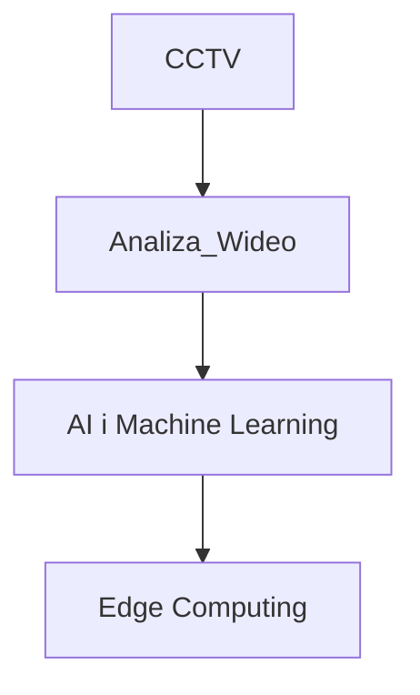
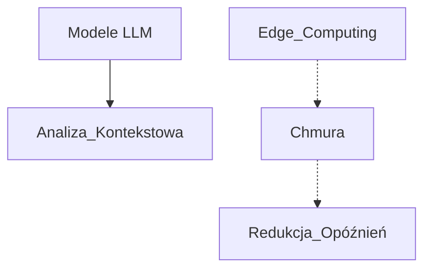
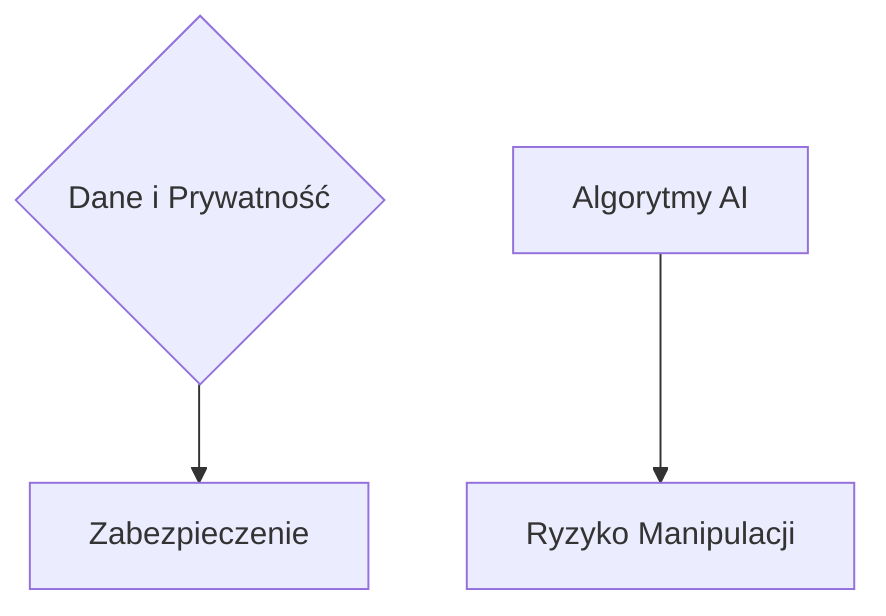
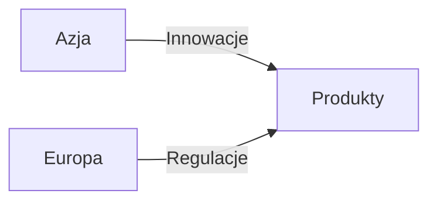
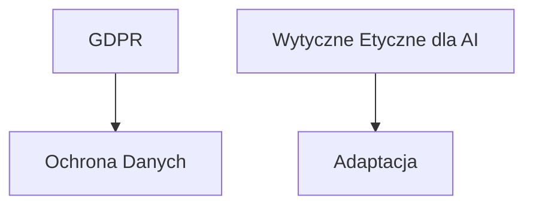
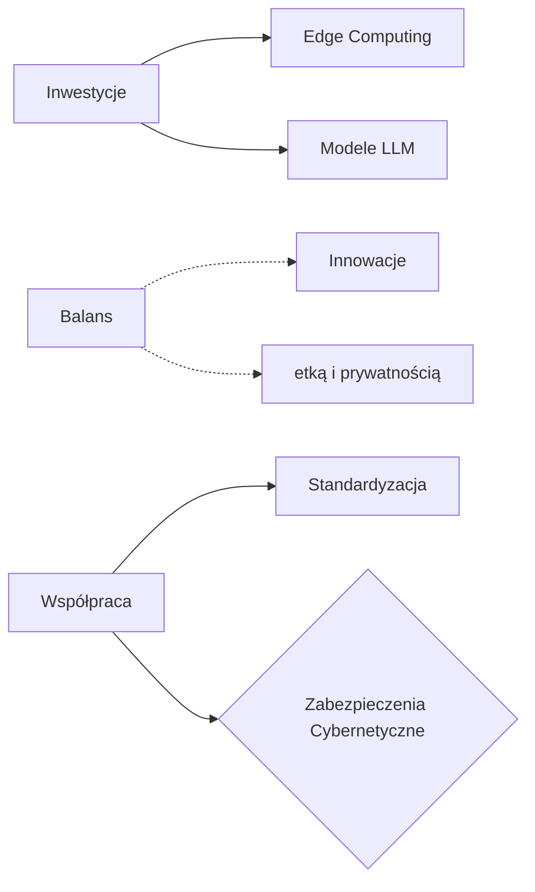

# [www.teleoperator.info](https://www.teleoperator.info/)

Zrozumienie rynku systemów wizyjnych i rozpoznawania obiektów nabiera jeszcze szybszego tempa z racji rozwoju nowych modeli LLM.
w roku 2024 nie jest łatwe, [teleoperator](https://www.teleoperator.info/) służy analizie jakościowej aktualnych trendów, by odpowiedzieć sobie na pytania:
- Jak zmieniał się rynek domen w ostatniej dekadzie?
- Jak zmieni się rynek do roku 2030?

W obliczu dynamicznie zmieniającego się krajobrazu technologicznego, ten raport rzuca światło na postępującą ewolucję infrastruktury internetowej, wyznaczaną przez rozwój sieci 5G i perspektywy wdrożenia 6G. 
Dokument skupia się na fundamentach i konwekwencjach w której prywatne domeny providerów 5G/6G odgrywają kluczową rolę jako pośrednicy w dostępie do domen publicznych.

Raport systemów rozpoznawnaia obiektów dla systów monitorowania CCTV z wykorzystaniem edge computing z przeetwarzaniem LLM obiektów.
Zrozumienie rynku systemów wizyjnych i rozpoznawania obiektów nabiera jeszcze szybszego tempa z racji rozwoju nowych modeli LLM.

### Główne Punkty

#### Obecna Struktura

#### Nowe Warstwy Bezpieczeństwa

#### Zmiany prawne i technologiczne

### Rekomendacje:

Dla **deweloperów**, **spekulantów**, **inwestorów**, **specjalistów IT**, raport stanowi kluczowe źródło wiedzy o kierunkach rozwoju infrastruktury internetowej oraz przyszłych wyzwaniach w zakresie bezpieczeństwa cyfrowego. 
**Decydenci biznesowi** znajdą w nim cenne informacje na temat nadchodzących zmian, które mogą wywierać wpływ na strategie cyfrowe ich organizacji. Dla **entuzjastów technologii** i **studentów**, dokument oferuje głęboki wgląd w przyszłość komunikacji internetowej.

### Udostępnij w Social Mediach:

Myślisz o przyszłości internetu i jak technologie 5G/6G odmienią świat domen internetowych? 🌐💡 Sprawdź nasz najnowszy raport, który zagłębia się w nadchodzące zmiany infrastruktury internetowej! 
Idealna lektura dla każdego technofila! #5G #6G #InternetPrzyszłości #BezpieczeństwoCyfrowe ➡️ [teleoperator](https://www.teleoperator.info/)

### Raport: Systemy Rozpoznawania Obiektów dla Monitoring CCTV z Wykorzystaniem Edge Computing i Przetwarzania LLM

Rynek systemów wizyjnych i technologii rozpoznawania obiektów przeżywa dynamiczny rozwój, napędzany postępem w modelach uczenia głębokiego, zwłaszcza w przetwarzaniu języka naturalnego (LLM - Large Language Models). Dzięki tym innowacjom, możliwe staje się implementowanie zaawansowanych systemów monitoringu wideo, które nie tylko efektywniej rozpoznają i śledzą obiekty, ale również interpretują kontekst sytuacyjny, oferując bezprecedensową precyzję i inteligencję systemów CCTV.

### Główne Punkty Prezentacji Raportu:

#### 1. **Rynek Ostatniej Dekady:**
- Ewolucja z klasycznych systemów CCTV do inteligentnych rozwiązań z wykorzystaniem AI i machine learning.
- Wzrost znaczenia analizy wideo w czasie rzeczywistym dzięki edge computing.

#### 2. **Obecna Sytuacja:**
- Dominacja modeli LLM w analizie kontekstowej obrazów i wideo.
- Integracja z chmurą i urządzeniami edge computing zapewniająca redukcję opóźnień i usprawnienie reakcji systemów.

#### 3. **Wyzwania Cyberbezpieczeństwa:**
- Zabezpieczenie danych i prywatności w systemach rozpoznających obiekty.
- Ryzyko manipulacji obrazem i ataków na algorytmy AI.

#### 4. **Produkty i usługi z Azji vs z Europy:**
- Porównanie podejść regulacyjnych i innowacyjnych między Azją a Europą.
- Wpływ różnic kulturowych i technologicznych na rozwój systemów CCTV.

#### 5. **Zmiany Prawne i Technologiczne w Europie:**
- Adaptacja do GDPR i innych regulacji dotyczących ochrony danych.
- Wprowadzenie etycznych wytycznych dla AI i systemów monitoringu.

#### 6. **Rekomendacje:**
- Inwestycje w rozwój technologii edge computing i LLM dla optymalizacji systemów monitoringu.
- Podkreślenie konieczności balansu między innowacjami a etyką i prywatnością.
- Współpraca międzynarodowa w standardyzacji i zabezpieczeniach cybernetycznych.

Podsumowując, rynek systemów rozpoznawania obiektów dla monitoringu CCTV ewoluuje w kierunku coraz większej integracji z zaawansowanymi technologiami AI, zwłaszcza z wykorzystaniem przetwarzania LLM oraz edge computing. Mimo wyzwań, takich jak cyberbezpieczeństwo czy regulacje prawne, przyszłość zapowiada się obiecująco pod kątem możliwości jakie niosą te innowacje.

### Dyskusja

+ [askdomainer/2024 · Discussion #1](https://github.com/askdomainer/2024/discussions/1)

## Wstęp

### Domain Name System

System DNS (Domain Name System) odgrywa kluczową rolę w funkcjonowaniu Internetu, tłumacząc łatwe do zapamiętania nazwy domen (np. www.example.com) na skomplikowane adresy IP (np. 192.0.2.1), które są wykorzystywane przez komputery do łączenia się ze sobą. Chociaż system ten jest niezwykle efektywny w mapowaniu nazw stron internetowych, istnieją obszary, w których wykorzystanie DNS mogło być bardziej innowacyjne. O czym napisano w kolejnych punktach.

### Komunikacja

Wykorzystanie domen internetowych w komunikacji między ludźmi (H2H - Human-to-Human) oraz między człowiekiem a maszyną (H2M - Human-to-Machine) mogło otworzyć nowe możliwości dla interakcji w cyfrowym świecie. Proces ten miał potencjał zastąpienia skomplikowanych identyfikatorów numerycznych, adresów IP, identyfikatorów sprzętowych oraz innych trudnych do zapamiętania ciągów cyfr, ułatwiając użytkownikom nawigację i interakcję. 

## Zaprzepaszczone Szanse

## Przyczyny spadku wartości domen internetowych

## Najnowsze Technologie i Bezpieczeństwo 

## Interfejs

Zapotrzebowanie na domeny internetowe jest ściśle powiązane z rodzajem interfejsu i sposobem, w jaki użytkownicy lub systemy mają dostęp do zasobów cyfrowych. Interfejsy, które ułatwiają bezpośrednią, łatwą i często publiczną interakcję, zazwyczaj korzystają na posiadaniu własnych, łatwych do zapamiętania domen internetowych. W przeciwieństwie do tego, niektóre interfejsy mogą funkcjonować efektywnie bez domen, polegając na innych metodach identyfikacji lub lokalnym dostępie. 

## Przyszłość rynku rozpoznawania obiektów do roku 2030

Przewidywanie przyszłego rozwoju rynku domen do roku 2030 należy wziąć pod uwagę dynamikę technologii i zmieniające się preferencje użytkowników. 
Opierając się na obecnych trendach i możliwych kierunkach ewolucji technologicznej, można wysnuć pewne przypuszczenia:

1. **MarketsandMarkets** – Jest to firma analityczna oferująca raporty rynkowe w wielu sektorach, w tym w obszarze technologii bezpieczeństwa i monitoringu.

2. **Grand View Research** – Ta firma również specjalizuje się w analizach rynkowych i często publikuje raporty dotyczące rynku kamer bezpieczeństwa, identyfikacji wizualnej i technologii pokrewnych.

3. **Research and Markets** – Na tej platformie można znaleźć szeroki zakres raportów na temat różnych technologii, w tym również systemów bezpieczeństwa i monitoringu wizyjnego.

4. **Statista** – Serwis oferujący dostęp do danych statystycznych i rynkowych z różnych sektorów, w tym z rynku kamer i systemów monitoringu.

5. **TechSci Research** – Koncentruje się na dostarczaniu szczegółowych analiz i prognoz rynkowych z różnych branż technologicznych.

6. **Frost & Sullivan** – Firma doradztwa strategicznego, która publikuje raporty rynkowe, w tym analizy rynku systemów monitoringu i bezpieczeństwa. 

7. **IPVM** – Strona oferuje nie tylko analizy i raporty rynkowe, ale również testy produktów i porównania w dziedzinie monitoringu wideo i bezpieczeństwa.

Aby uzyskać dostęp do najnowszych raportów i analiz, warto odwiedzić strony tych firm i poszukać konkretnych raportów na temat rynku kamer, rejestratorów i technologii identyfikacji wizualnej. Zazwyczaj wymagane jest zakupienie dostępu do pełnych raportów, choć często można znaleźć streszczenia lub ograniczone wersje dostępne za darmo.

### Podsumowanie

Do roku 2030 rynek domen może stać się bardziej zróżnicowany, z większym naciskiem na bezpieczeństwo, regulacje oraz innowacje technologiczne takie jak blockchain. Chociaż specyficzne trendy mogą się zmieniać, jasne jest, że domeny internetowe pozostaną kluczowym zasobem w cyfrowym ekosystemie. Adaptacja do zmieniającego się środowiska technologicznego i regulacyjnego będzie niezbędna dla podmiotów działających na tym rynku.

---

## Tom Sapletta

Na co dzień DevOps i ewangelista hipermodularyzacji.
Łączy doświadczenie w programowaniu i research-u poprzez wdrażanie nowatorskich rozwiązań. 
Szerokie spektrum zainteresowań, umiejętności analityczne i doświadczenie w branży owocują pozatechnicznymi treściami jak powyższy raport.

+ [Tom Sapletta, Linkedin](https://www.linkedin.com/in/tom-sapletta-com)
+ [Tom Sapletta, Github](https://github.com/tom-sapletta-com)

---

