# [www.teleoperator.info](https://www.teleoperator.info/)

Zrozumienie rynku systemów wizyjnych i rozpoznawania obiektów nabiera jeszcze szybszego tempa z racji rozwoju nowych modeli LLM.
w roku 2024 nie jest łatwe, [raport AskDomainer](https://report.teleoperator.info/) służy analizie jakościowej aktualnych trendów, by odpowiedzieć sobie na pytania:
- Jak zmieniał się rynek domen w ostatniej dekadzie?
- Jak zmieni się rynek do roku 2030?

W obliczu dynamicznie zmieniającego się krajobrazu technologicznego, ten raport rzuca światło na postępującą ewolucję infrastruktury internetowej, wyznaczaną przez rozwój sieci 5G i perspektywy wdrożenia 6G. 
Dokument skupia się na fundamentach i konwekwencjach w której prywatne domeny providerów 5G/6G odgrywają kluczową rolę jako pośrednicy w dostępie do domen publicznych.

Raport systemów rozpoznawnaia obiektów dla systów monitorowania CCTV z wykorzystaniem edge computing z przeetwarzaniem LLM obiektów.
Zrozumienie rynku systemów wizyjnych i rozpoznawania obiektów nabiera jeszcze szybszego tempa z racji rozwoju nowych modeli LLM.

### Główne Punkty

#### Obecna Struktura

#### Nowe Warstwy Bezpieczeństwa

#### Zmiany prawne i technologiczne

### Rekomendacje:

Dla **deweloperów**, **spekulantów**, **inwestorów**, **specjalistów IT**, raport stanowi kluczowe źródło wiedzy o kierunkach rozwoju infrastruktury internetowej oraz przyszłych wyzwaniach w zakresie bezpieczeństwa cyfrowego. 
**Decydenci biznesowi** znajdą w nim cenne informacje na temat nadchodzących zmian, które mogą wywierać wpływ na strategie cyfrowe ich organizacji. Dla **entuzjastów technologii** i **studentów**, dokument oferuje głęboki wgląd w przyszłość komunikacji internetowej.

### Udostępnij w Social Mediach:

Myślisz o przyszłości internetu i jak technologie 5G/6G odmienią świat domen internetowych? 🌐💡 Sprawdź nasz najnowszy raport, który zagłębia się w nadchodzące zmiany infrastruktury internetowej! 
Idealna lektura dla każdego technofila! #5G #6G #InternetPrzyszłości #BezpieczeństwoCyfrowe ➡️ [2024.askdomainer.com](https://2024.askdomainer.com/)

### Raport: Systemy Rozpoznawania Obiektów dla Monitoring CCTV z Wykorzystaniem Edge Computing i Przetwarzania LLM

Rynek systemów wizyjnych i technologii rozpoznawania obiektów przeżywa dynamiczny rozwój, napędzany postępem w modelach uczenia głębokiego, zwłaszcza w przetwarzaniu języka naturalnego (LLM - Large Language Models). Dzięki tym innowacjom, możliwe staje się implementowanie zaawansowanych systemów monitoringu wideo, które nie tylko efektywniej rozpoznają i śledzą obiekty, ale również interpretują kontekst sytuacyjny, oferując bezprecedensową precyzję i inteligencję systemów CCTV.

### Główne Punkty Prezentacji Raportu:

#### 1. **Rynek Ostatniej Dekady:**
- Ewolucja z klasycznych systemów CCTV do inteligentnych rozwiązań z wykorzystaniem AI i machine learning.
- Wzrost znaczenia analizy wideo w czasie rzeczywistym dzięki edge computing.

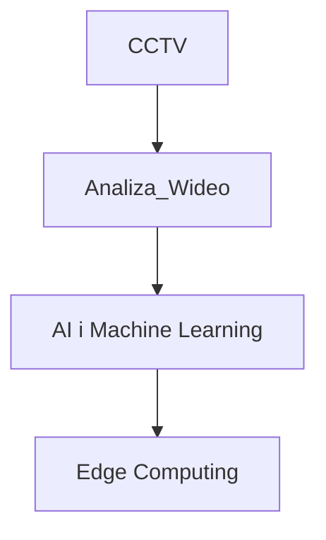

#### 2. **Obecna Sytuacja:**
- Dominacja modeli LLM w analizie kontekstowej obrazów i wideo.
- Integracja z chmurą i urządzeniami edge computing zapewniająca redukcję opóźnień i usprawnienie reakcji systemów.

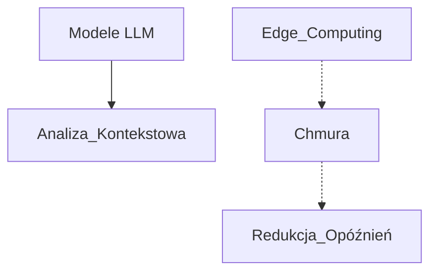

#### 3. **Wyzwania Cyberbezpieczeństwa:**
- Zabezpieczenie danych i prywatności w systemach rozpoznających obiekty.
- Ryzyko manipulacji obrazem i ataków na algorytmy AI.

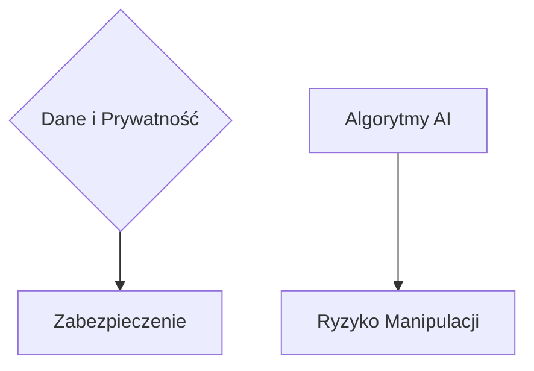

#### 4. **Produkty i usługi z Azji vs z Europy:**
- Porównanie podejść regulacyjnych i innowacyjnych między Azją a Europą.
- Wpływ różnic kulturowych i technologicznych na rozwój systemów CCTV.

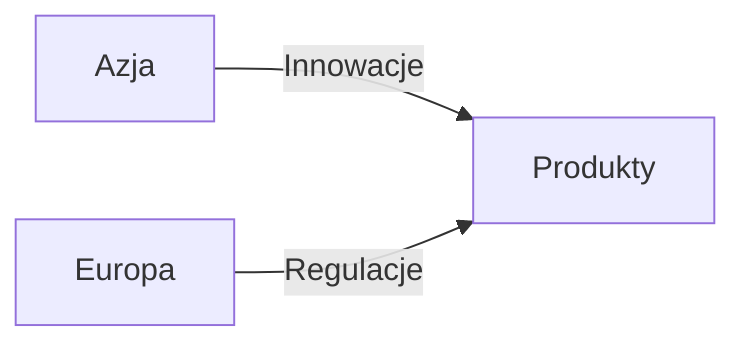

#### 5. **Zmiany Prawne i Technologiczne w Europie:**
- Adaptacja do GDPR i innych regulacji dotyczących ochrony danych.
- Wprowadzenie etycznych wytycznych dla AI i systemów monitoringu.

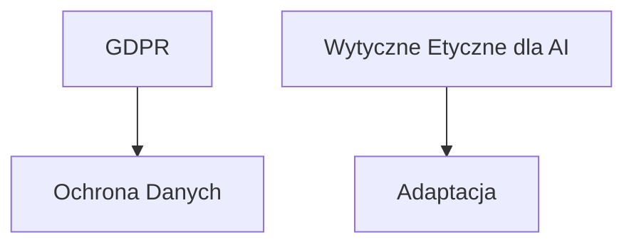

#### 6. **Rekomendacje:**
- Inwestycje w rozwój technologii edge computing i LLM dla optymalizacji systemów monitoringu.
- Podkreślenie konieczności balansu między innowacjami a etyką i prywatnością.
- Współpraca międzynarodowa w standardyzacji i zabezpieczeniach cybernetycznych.

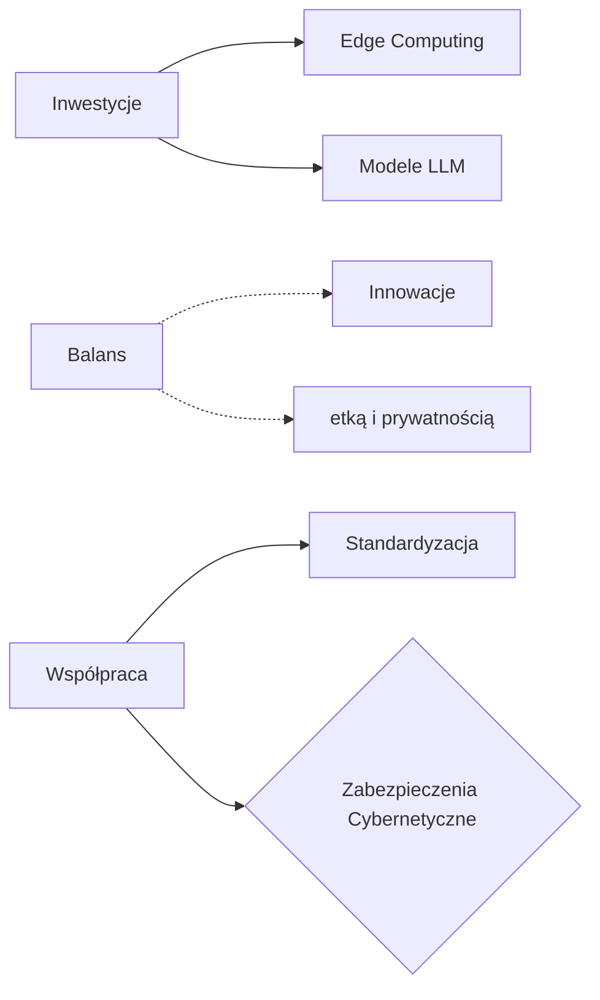

Podsumowując, rynek systemów rozpoznawania obiektów dla monitoringu CCTV ewoluuje w kierunku coraz większej integracji z zaawansowanymi technologiami AI, zwłaszcza z wykorzystaniem przetwarzania LLM oraz edge computing. Mimo wyzwań, takich jak cyberbezpieczeństwo czy regulacje prawne, przyszłość zapowiada się obiecująco pod kątem możliwości jakie niosą te innowacje.

### Dyskusja

+ [askdomainer/2024 · Discussion #1](https://github.com/askdomainer/2024/discussions/1)

## Wstęp

### Domain Name System

System DNS (Domain Name System) odgrywa kluczową rolę w funkcjonowaniu Internetu, tłumacząc łatwe do zapamiętania nazwy domen (np. www.example.com) na skomplikowane adresy IP (np. 192.0.2.1), które są wykorzystywane przez komputery do łączenia się ze sobą. Chociaż system ten jest niezwykle efektywny w mapowaniu nazw stron internetowych, istnieją obszary, w których wykorzystanie DNS mogło być bardziej innowacyjne. O czym napisano w kolejnych punktach.

### Komunikacja

Wykorzystanie domen internetowych w komunikacji między ludźmi (H2H - Human-to-Human) oraz między człowiekiem a maszyną (H2M - Human-to-Machine) mogło otworzyć nowe możliwości dla interakcji w cyfrowym świecie. Proces ten miał potencjał zastąpienia skomplikowanych identyfikatorów numerycznych, adresów IP, identyfikatorów sprzętowych oraz innych trudnych do zapamiętania ciągów cyfr, ułatwiając użytkownikom nawigację i interakcję. 

### Usługi

Firmy coraz intensywniej korzystają z rozwiązań chmurowych, pojęcia takie jak SaaS, PaaS, czy FaaS zdobywają na popularności. 
Rozwój chmury obliczeniowej i modeli dostarczania usług takich jak SaaS, PaaS i FaaS zrewolucjonizował sposób, w jaki firmy i deweloperzy budują i zarządzają aplikacjami internetowymi. 
Każdy z tych modeli oferuje unikalne korzyści i jest odpowiedni dla różnych przypadków użycia, pomagając przy tym zminimalizować koszty i zwiększyć efektywność.
Każde z nich opisuje inne podejście do dostarczania usług i tworzenia infrastruktury internetowej:

#### SaaS (Software as a Service)

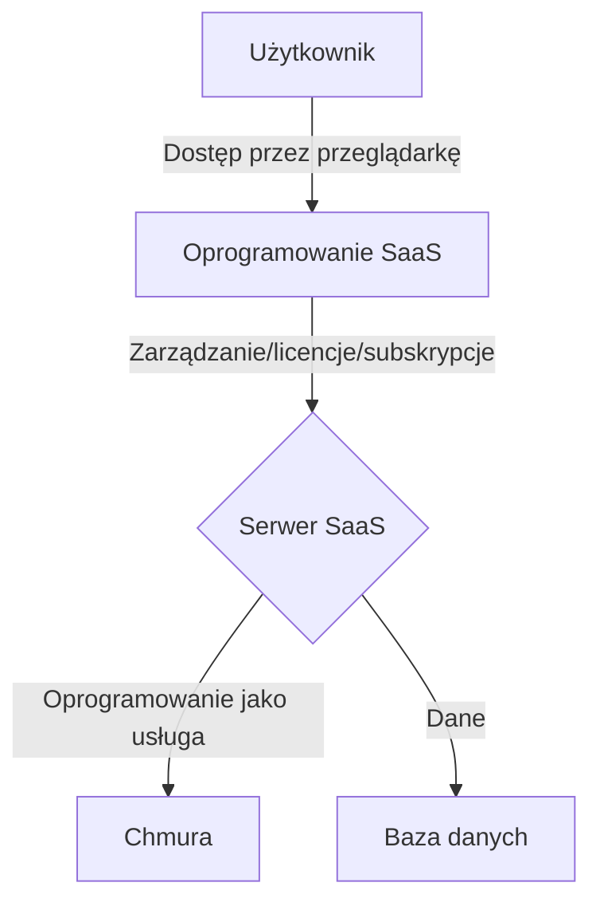

Model **SaaS** polega na dostarczaniu gotowego oprogramowania jako usługi przez internet. Użytkownicy subskrybują usługę, najczęściej na zasadzie miesięcznej lub rocznej opłaty, zamiast kupować i instalować oprogramowanie na własnych komputerach.

**Korzyści:**
- **Brak konieczności instalacji i utrzymania oprogramowania**: Użytkownik nie musi martwić się o aktualizacje, konserwację czy kompatybilność sprzętową.
- **Elastyczność i skalowalność**: Łatwość dostosowania ilości licencji do aktualnych potrzeb firmy.
- **Dostępność**: Dostęp do aplikacji z dowolnego miejsca i na dowolnym urządzeniu z dostępem do internetu.

**Przykłady**: Google Apps, Salesforce, Dropbox, Slack.

#### PaaS (Platform as a Service)

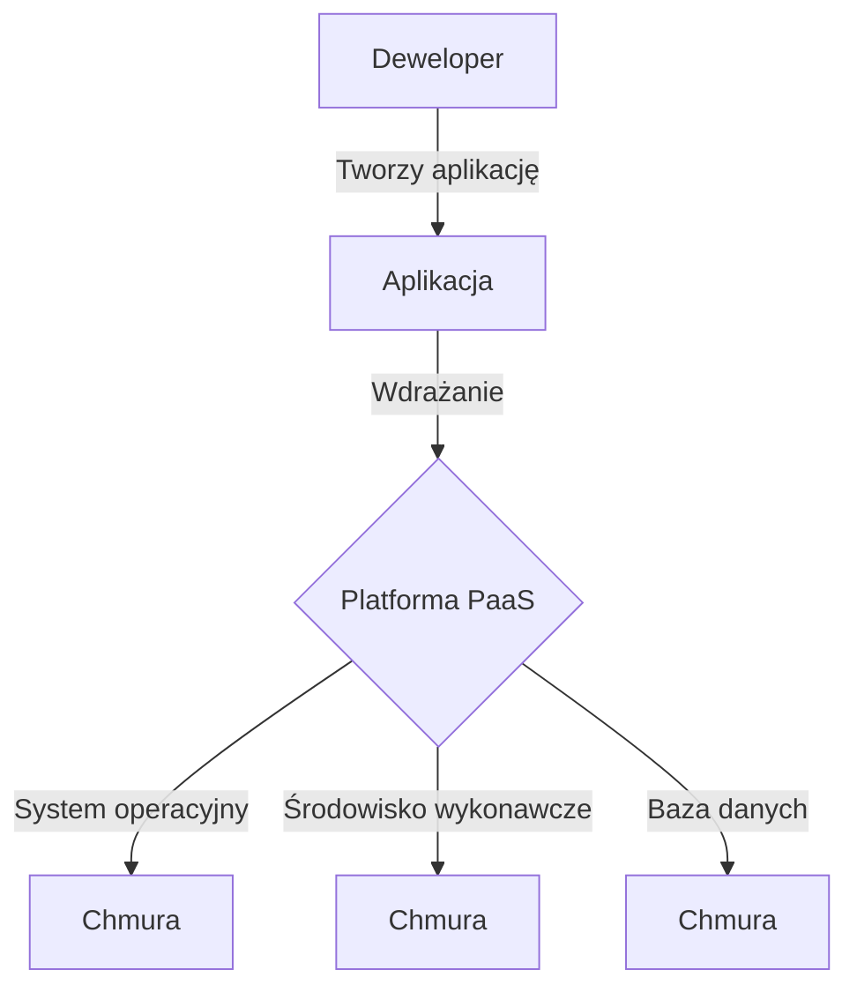

Model **PaaS** dostarcza kompletną platformę programistyczną w chmurze, włączając w to system operacyjny, środowisko wykonawcze języka programowania, bazę danych, i narzędzia deweloperskie. Pozwala to deweloperom na tworzenie, wdrażanie i zarządzanie aplikacjami bez martwienia się o infrastrukturę podstawową.

**Korzyści:**
- **Zmniejszenie złożoności**: Deweloperzy mogą skoncentrować się na kodowaniu i innowacjach, nie martwiąc się o konserwację infrastruktury.
- **Szybkie prototypowanie i wdrażanie**: Platformy PaaS oferują narzędzia, które ułatwiają szybkie tworzenie i wdrażanie aplikacji.
- **Wbudowana skalowalność**: Możliwość łatwego skalowania aplikacji w zależności od zapotrzebowania.

**Przykłady**: Heroku, Google App Engine, Azure Web Services.

#### FaaS (Function as a Service)

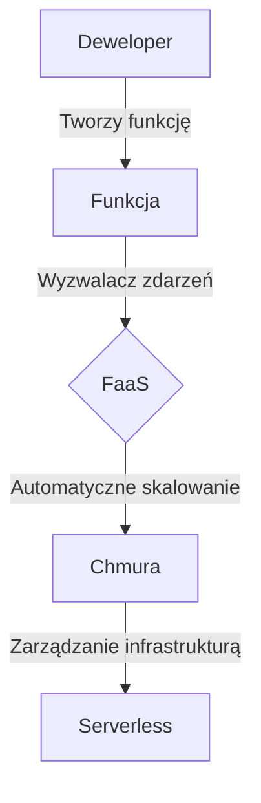

**FaaS**, znane również jako bezserwerowa architektura (serverless computing), to model pośredni między SaaS a PaaS. Umożliwia uruchamianie fragmentów kodu (funkcji) w odpowiedzi na zdarzenia, bez konieczności zarządzania serwerami lub infrastrukturą aplikacji. 

**Korzyści:**
- **Skupienie się na pojedynczych funkcjach**: Deweloperzy mogą skupić się na pisaniu poszczególnych funkcji, nie martwiąc się o całą aplikację.
- **Zwinność i szybkie wdrażanie**: Ułatwia eksperymentowanie i wprowadzanie małych zmian bez konieczności ponownego wdrażania całej aplikacji.
- **Optymalizacja kosztów**: Płacisz tylko za czas wykonania twoich funkcji, nie za nieużywane serwery.

**Przykłady**: AWS Lambda, Azure Functions, Google Cloud Functions.

#### Chmura (Cloud Computing)

Chmura, czyli cloud computing, to model dostarczania różnorodnych usług IT poprzez internet. Usługi te mogą obejmować serwery, przechowywanie danych, bazy danych, sieci, oprogramowanie, analitykę i inteligencję. Chmura umożliwia firmom unikanie kosztów i złożoności związanych z zakupem i konserwacją własnej infrastruktury IT. Cloud computing można podzielić na trzy główne kategorie usług: Infrastructure as a Service (IaaS), Platform as a Service (PaaS) i Software as a Service (SaaS).

**korzyści:**

- **Elastyczność i skalowalność:** łatwa dostosowanie zasobów IT do aktualnych potrzeb.
- **Koszty:** potencjał zmniejszenia wydatków operacyjnych dzięki modelowi płatności za faktyczne użycie.
- **Dostępność:** dostęp do aplikacji i danych z dowolnego miejsca na świecie.
- **Efektywność:** szybsze wdrożenia nowych aplikacji i usług.

#### Serverless (Bezserwerowa architektura)

Serverless, czyli architektura bezserwerowa, jest modelem wykonania w chmurze, w którym dostawca chmury zarządza uruchamianiem kodu aplikacji przez alokowanie zasobów obliczeniowych na żądanie. To eliminuje potrzebę ciągłego i aktywnego zarządzania serwerami przez deweloperów. Jednak nie oznacza to, że serwery fizycznie nie istnieją; oznacza to raczej, że zajmowanie się nimi nie jest już problemem deweloperów.

**korzyści:**

- **Brak zarządzania serwerami:** Infrastruktura jest abstrahowana.
- **Płatność za rzeczywiste użycie:** Opłaty są naliczane tylko wtedy, gdy kod jest wykonywany.
- **Automatyczne skalowanie:** Aplikacje są skalowane automatycznie w zależności od zapotrzebowania.

#### Jak Serverless Wiąże Się z Chmurą?

"Serverless" i "chmura" to dwa terminy, które często pojawiają się razem, ale odnoszą się do różnych aspektów technologii obliczeniowych. Chociaż oba koncepty są ze sobą powiązane, mają unikalne cechy i służą różnym celom w ekosystemie IT. Oto przegląd tych dwóch pojęć i jak się ze sobą łączą:

Serverless to model dostarczania usług, który jest ściśle powiązany z cloud computing. Jest wręcz rodzajem "produktu" oferowanego w ramach usług chmury. Dzięki technologii cloud dostawca usług (np. AWS, Azure, Google Cloud) może oferować rozwiązania serverless, takie jak AWS Lambda, które umożliwiają uruchamianie kodu bez konieczności zarządzania infrastrukturą serwerową.

W dużym uproszczeniu można powiedzieć, że "chmura" dostarcza szeroki zakres usług obliczeniowych przez internet, a "serverless" jest jednym z modeli korzystania z tych usług, koncentrującym się na automatyzacji zarządzania infrastrukturą i optymalizacji kosztów.

#### No Code

"No Code" to podejście, w którym tworzenie aplikacji odbywa się całkowicie bez pisania jakiegokolwiek kodu. Zamiast tradycyjnego kodowania, wykorzystuje się graficzne interfejsy użytkownika z funkcjami przeciągnij-i-upuść (drag-and-drop), aby tworzyć logikę i funkcjonalności aplikacji. Ta metodyka otwiera drzwi dla nieprogramistów, tzw. "obywatelskich deweloperów" (citizen developers), do szybkiego tworzenia aplikacji dopasowanych do ich potrzeb.

**Korzyści:**

- **Szybszy rozwój:** Umożliwia szybkie prototypowanie i iterowanie aplikacji.
- **Niskie koszty startupowe:** Zmniejsza barierę wejściową dla małych firm i przedsiębiorców, którzy chcą szybko wprowadzić swoje pomysły w życie.
- **Demokratyzacja tworzenia oprogramowania:** Umożliwia osobom bez tła technicznego projektowanie i tworzenie aplikacji.

#### Low Code

"Low Code" to podejście, które wciąż wymaga pewnej minimalnej ilości pisania kodu, ale znacząco ogranicza jego ilość poprzez korzystanie z gotowych bloków funkcjonalnych i graficznych edytorów. Pozwala to na szybsze tworzenie aplikacji, jednocześnie oferując większą elastyczność i kontrolę niż podejście "No Code".

**Korzyści:**

- **Większa elastyczność:** Deweloperzy mają więcej kontroli nad aplikacją i mogą dostosować kod, gdzie jest to potrzebne.
- **Przyspieszony rozwój:** Podobnie jak "No Code", umożliwia szybsze dostarczanie aplikacji dzięki wykorzystaniu elementów wizualnego programowania.
- **Łatwiejsze zarządzanie:** Aplikacje "Low Code" mogą być łatwiej zarządzane i utrzymywane dzięki zastosowaniu standardowych komponentów.

#### Porównanie "No Code" i "Low Code"

Chociaż "No Code" i "Low Code" wydają się podobne, kluczowa różnica polega na ich celu i publiczności docelowej. "No Code" jest raczej skierowane do osób bez żadnego doświadczenia programistycznego, umożliwiając im tworzenie prostych do średnio skomplikowanych aplikacji. "Low Code", z kolei, celuje w profesjonalnych deweloperów, dając im narzędzia, które przyspieszają rozwój aplikacji, ale też pozwalają na niestandardowe dostosowania tam, gdzie są one potrzebne.

Obydwa podejścia odpowiadają na potrzebę szybszego dostarczania oprogramowania w dynamicznie zmieniającym się świecie technologii i biznesu, oferując jednocześnie nowe możliwości dla przedsiębiorców, deweloperów oraz organizacji rozmaitych rozmiarów.

## Zaprzepaszczone Szanse

Warto zauważyć, że te "zaprzepaszczone szanse" nie są jednoznacznie stratami; są one raczej oznaką ewolucji technologii i preferencji użytkowników, jak również adaptacyjności systemu DNS do rosnących wymagań bezpieczeństwa i funkcjonalności. Ponadto, bardziej zaawansowane technologie, takie jak wspomniane blockchainy, mogą oferować nowe sposoby realizacji tych idei, potencjalnie przezwyciężając ograniczenia, które uniemożliwiły ich pełne wdrożenie w przeszłości.

### Usługi bankowe i płatności

Zastąpienie numerów kont bankowych i systemów płatności

Podobnie jak w przypadku numerów kont bankowych i systemów płatności, nazwy domen mogłyby ułatwić przeprowadzanie transakcji finansowych online. Zamiast wprowadzać skomplikowane numery kont, użytkownicy mogliby korzystać z łatwych do zapamiętania nazw, które bezpośrednio wskazują na ich konta.
Jednak bezpieczeństwo i regulacje bankowe wymagają dokładności i bezbłędności, które to są trudne do osiągnięcia w otwartym, rozproszonym systemie jak DNS. Wymóg zachowania bezpieczeństwa transakcji finansowych prawdopodobnie ograniczyłby możliwości takiego zastosowania DNS, chociaż idee takie jak blockchain oferują alternatywne podejścia do rozwiązania tych problemów.

### Uniwersalne identyfikatory

DNS mógłby teoretycznie służyć jako platforma dla uniwersalnych identyfikatorów cyfrowych, umożliwiając łatwiejsze zarządzanie tożsamościami w Internecie. Jednakże wyzwania związane z prywatnością, zarządzaniem i bezpieczeństwem znacząco utrudniają takie zastosowania.

### Telekomunikacja

Zastąpienie numerów telefonów

W telekomunikacji, zamiast stosowania tradycyjnych numerów telefonów, kontakty mogłyby być identyfikowane poprzez nazwy domen. Choć próby takie były podejmowane (np. protokół ENUM), nie osiągnęły one szerszego użycia na skalę masową.
Możliwość użycia nazw domen zamiast numerów telefonów wydaje się kusząca z punktu widzenia łatwości zapamiętywania. Przykładowo, zamiast wymieniania długiego ciągu cyfr, można by było powiedzieć komuś, aby zadzwonił do Ciebie na adres "contact.me@example.com". Technologie takie jak ENUM (Telephone Number Mapping) próbowały połączyć system DNS z tradycyjną telefonią, ale nie osiągnęły szerokiego przyjęcia z powodu skomplikowanego wdrożenia, problemów prywatności, oraz konkurencji ze strony systemów VoIP i komunikatorów internetowych.

### Internet rzeczy (IoT)

Identyfikacja urządzeń i zarządzanie nimi

Domeny internetowe mogłyby zastąpić skomplikowane adresowanie w systemach IoT, ułatwiając użytkownikom identyfikację i komunikację z urządzeniami. Na przykład, zamiast korzystać z długiego i skomplikowanego adresu IP do połączenia się z inteligentną lodówką, użytkownik mógłby po prostu wpisać prostą i intuicyjną nazwę domeny. W kontekście zarządzania flotą urządzeń, takich jak serwery, routery czy też drukarki w dużych organizacjach, ułatwiając zarządzanie i konserwację.

## Przyczyny spadku wartości domen internetowych

Mimo potencjalnych zalet, kilka czynników ograniczyło szerokie przyjęcie domen internetowych w tych kontekstach:

### Bezpieczeństwo i prywatność
Na przykład, wrażliwość danych finansowych wymaga dodatkowych warstw zabezpieczeń, których nie zawsze można zapewnić tylko za pomocą nazw domen.

### Techniczne ograniczenia
System DNS, choć niezwykle skalowalny, mógłby napotkać problemy z wydajnością lub celować w zagrożenia, gdyby był nadużywany lub nadmiernie obciążony zapytaniami.

### Opór przed zmianą
Zakorzenione w zwyczajach użycie numerów telefonów i identyfikatorów numerycznych może być trudne do zmienienia, szczególnie w kontekstach, które już dobrze funkcjonują.

W skrócie, choć domeny internetowe oferują atrakcyjną alternatywę dla skomplikowanych ciągów numerycznych, istnieje wiele wyzwań związanych z ich implementacją na szeroką skalę w niektórych obszarach. Moment ten wymaga zarówno innowacji technologicznych, jak i zmian w sposobie myślenia użytkowników oraz regulacjach prawnych.

### Sposób tworzenia stron internetowych
SaaS zamiast PaaS 
w roku 2024 mamy dostęp do wielu usług SaaS, które ułatwiają stworzenie działającej strony internetowej.
Coraz powszechniej są dostępne personalizowane usługi w modelu SaaS ułatwiające tworzenie stron bez udziału Software House-ów

Dekadę temu aby stworzyć stronę www potrzebna była minimalna wiedza do korzystania z PaaS.
Dziś wystarczy tylko dodać nameserver do domeny lub zakupić ją bezpośrednio u usługodawcy.

### Zmiana pokoleniowa

mniejsze zapotrzebowanie na domeny jest wynikiem świadomości oraz sposobu dostepu do treści, 
w przypadku zmiany przeglądarkę na aplikację nie jest koneiczne używanie przez użytkownika domen internetowych

### Zmiana interfejsu komunikacji

+ Interfejs głosowy zamiast graficznego, np. chat/asystent głosowy zmaiast Wyszkiwarki
+ Aplikacje zamiast stron internetowych
+ Platformy automatyzujące, API, komunikacja M2M zamiast interakcji z użytkownikiem

### Nadmiar dostępnych nazw domen

Wprowadzenie nowych, generycznych domen najwyższego poziomu (gTLDs) na rynek może spowodować przesycenie i zmniejszenie unikalności posiadania specyficznej nazwy domeny.

### Zmiany w zachowaniach użytkowników

Młodsze pokolenia mogą coraz częściej korzystać z aplikacji społecznościowych, wyszukiwarek wbudowanych w urządzenia czy innych form dostępu do treści online, co sprawia, że tradycyjne domeny internetowe tracą na znaczeniu.

### Innowacje technologiczne

Rozwój alternatywnych technologii, takich jak zdecentralizowany internet (np. technologia blockchain), może zmniejszyć zależność od tradycyjnych struktur nazw domen.

### Zmiany regulacyjne i prawne
Nowe prawa i regulacje dotyczące internetu, prywatności danych oraz cyfrowych aktywów mogą wpłynąć na sposób, w jaki domeny są wyceniane i handlowane.

### Polityka rejestrów

W październiku 2022 NASK podniósł ceny domen o 10 zł netto (.pl) lub więcej (regionalne, idn).
W 2023 roku zostało odnowionych 1,75 mln domen, co oznacza dodatkowy przychód 17+ mln zł.
Dziś dowiadujemy się, że w połowie 2022 pan Morawiecki zainstalował w NASK "dział przeciwdziałania dezinformacji", który realnie zajmował się monitorowaniem reakcji Internetu na działania Polityków i sprawdzaniem, co myślą Polacy przed wyborami, a którego działalność kosztowała łącznie 19 mln zł. 
+ [źródło](https://di.pl/topic/126431-na-co-posz%C5%82a-kasa-z-podwy%C5%BCek-cen-domen/?tab=comments#comment-674309)

### Handel domenami na rynku wtórnym

Domeny tracą na rzecz platform SaaS, które nie wymagają posiadania własnej domeny, a tych, którzy robią coś sensownego pod własną domeną jest coraz mniej, młode pokolenia coraz rzadziej widzą sens w kupowaniu domen.
Komu wazrost cen najbardziej zaszkodził? 

Detaliści i tak ich nie przedłużą jak im nie są potrzebne a sprzedawać na rynku wtórnym nie chcą, nie umieją luub nie wiedzą potrzeby.
Obawiam się, że to posiadacze większych portfolio domen, dziąłający na rynku wtórnym finansują synekury.
W tym samym czasie domeny .de sa dostępne w cenach poniżej 10EUR a przyrost cen .com jest, chociaż częściowo uzasadniony z racji znaczenia w globalnej podaży domen internetowych.

## Najnowsze Technologie i Bezpieczeństwo 

Zakup własnej domeny internetowej do infrastruktury, zwłaszcza w kontekście rozwiniętych sieci oraz systemów Human-to-Machine (H2M) działających w sieciach 5G i 6G, może przynieść wiele korzyści oraz ułatwień. 

### Korzyści z zakupu własnej domeny internetowej

#### Profesjonalizm i marka

Własna domena przyczynia się do budowania marki i jest znakiem profesjonalizmu. 
Ten argument od zawsze był istotny, gdyż domeny internetowe łączą infrastrukutrę z człowiekiem poprzez zrozumiały przez człowieka adres zasobu.
Domena internetowa nie jest technicznie konieczna do działania systemów H2M opartych na sieciach 5G i 6G. 
Urządzenia i serwisy mogą komunikować się bezpośrednio przez adresy IP lub lokalne identyfikatory. 
Jednakże w przypadkach, gdy system zakłada interakcję z użytkownikiem (np. przez przeglądarkę lub aplikację mobilną), własna domena może znacząco ułatwić dostęp i zarządzanie.
  

#### Kontrola nad infrastrukturą

Posiadanie własnej domeny daje większą kontrolę nad infrastrukturą i sposobem, w jaki dane są routowane w sieci. 
Umożliwia to lepsze zarządzanie bezpieczeństwem oraz optymalizację systemów.
W systemach H2M, użytkownicy (ludzie) czasem muszą mieć możliwość łatwego dostępu do interfejsów użytkownika lub paneli zarządzania urządzeniami, co jest ułatwione przez intuicyjne nazwy domen.
Aplikacje mogą komunikować się z urządzeniami lub serwerami, a łatwa do zapamiętania domena ułatwia zarządzanie i dostęp.

 
### Domena internetowa a warstwa szyfrowania

Warstwa szyfrowania komunikacji, takiej jak SSL/TLS (Secure Sockets Layer/Transport Layer Security), nie wymaga technicznie posiadania domeny internetowej. Szyfrowanie można zastosować do komunikacji opartej na adresach IP lub w sieciach zamkniętych. Jednakże, w praktyce, certyfikaty SSL/TLS, które zapewniają szyfrowanie i autentykację, są często wydawane dla konkretnych nazw domen. Posiadanie domeny ułatwia zatem wdrażanie szyfrowania "end-to-end" w dostępnych publicznie aplikacjach i usługach internetowych, zapewniając bezpieczeństwo danych użytkowników i systemu.

### Podsumowanie:

Choć technicznie możliwe jest projektowanie i używanie systemów H2M oraz implementacja warstw szyfrowania bez własnej domeny internetowej, posiadanie takiej domeny może przynieść znaczące korzyści w zakresie łatwości dostępu, zarządzania bezpieczeństwem i profesjonalizmu. W kontekście rozwijających się sieci 5G i 6G, które umożliwiają jeszcze większą integrację i komunikację między urządzeniami, własna domena internetowa może stać się coraz bardziej wartościowym zasobem.

## Interfejs

Zapotrzebowanie na domeny internetowe jest ściśle powiązane z rodzajem interfejsu i sposobem, w jaki użytkownicy lub systemy mają dostęp do zasobów cyfrowych. Interfejsy, które ułatwiają bezpośrednią, łatwą i często publiczną interakcję, zazwyczaj korzystają na posiadaniu własnych, łatwych do zapamiętania domen internetowych. W przeciwieństwie do tego, niektóre interfejsy mogą funkcjonować efektywnie bez domen, polegając na innych metodach identyfikacji lub lokalnym dostępie. 

### Interfejsy wymagające domen internetowych:

#### Strony WWW

Tradycyjne strony internetowe, sklepy online, blogi itp., które są dostępne dla szerokiej publiczności, korzystają z domen internetowych, aby ułatwić użytkownikom dostęp poprzez łatwe do zapamiętania adresy URL. 
Domena stanowi integralną część marki w internecie.

#### Web aplikacje

Aplikacje działające w przeglądarce, oferujące szeroki zakres usług (od narzędzi biurowych po platformy rozrywkowe), wymagają domen internetowych do łatwego dostępu i promocji.

#### API (Application Programming Interface)

API to oparte na sieci publicznie dostępne interfejsy programistyczne, które pozwalają na integrację z różnymi usługami i aplikacjami, często korzystają z domen internetowych, aby zapewnić stabilny i łatwo dostępny punkt dostępu.

### Interfejsy, które nie wymagają domen internetowych:

#### Aplikacje desktopowe
Aplikacje instalowane na komputerze użytkownika często komunikują się z internetem lub serwerami backendowymi bezpośrednio przez adresy IP lub za pomocą wewnętrznych identyfikatorów. Domena internetowa nie jest potrzebna do funkcjonowania aplikacji.

#### Aplikacje mobilne
Podobnie jak aplikacje desktopowe, aplikacje mobilne mogą korzystać z usług internetowych bezpośrednio przez zaprogramowane punkty końcowe, które nie muszą być domenami internetowymi zrozumiałymi dla użytkownika końcowego.

#### Wewnętrzne narzędzia i systemy
Systemy używane wewnętrznie przez przedsiębiorstwa, takie jak narzędzia do zarządzania bazami danych, wewnętrzne portale pracownicze czy systemy zarządzania treścią (CMS), mogą działać w izolowanej sieci korporacyjnej, wykorzystując nazwy hostów lub lokalne adresy IP bez potrzeby posiadania publicznych domen internetowych.

#### Interfejsy dla urządzeń IoT
Chociaż niektóre urządzenia IoT mogą korzystać z domen w celach zarządzania lub monitorowania, sama komunikacja między urządzeniami lub z serwerami backendowymi często odbywa się za pomocą protokołów komunikacyjnych specyficznych dla IoT, które nie wymagają użycia domen internetowych w tradycyjnym sensie.

### Podsumowanie:

Ogólnie rzecz biorąc, zapotrzebowanie na domeny internetowe zależy od natury interfejsu i publicznego dostępu do usługi. Publicznie dostępne serwisy, które wymagają łatwej identyfikacji i dostępu, będą miały większe korzyści z używania domen. W kontrze, aplikacje i systemy działające w zamkniętych środowiskach.

## Przyszłość rynku domen do roku 2030

Przewidywanie przyszłego rozwoju rynku domen do roku 2030 należy wziąć pod uwagę dynamikę technologii i zmieniające się preferencje użytkowników. 
Opierając się na obecnych trendach i możliwych kierunkach ewolucji technologicznej, można wysnuć pewne przypuszczenia:

#### Wzrost znaczenia domen internetowych

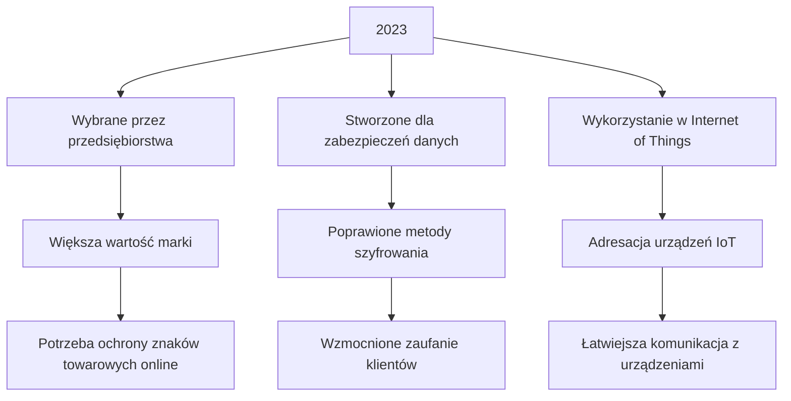

### Kolejne warstwy infrastruktury

Poniżej przedstawiam sposób, w jaki można zobrazować opisaną infrastrukturę za pomocą notacji Mermaid. Diagram przedstawia uproszczone podejście do ewolucji infrastruktury od obecnej struktury "Numer -> domena -> Certyfikat" do przyszłej struktury, w której domena prywatna providera 5G/6G odgrywa rolę pośrednika przed dotarciem do domeny publicznej i kolejnych certyfikatów:

#### Dzisiejsza infrastruktura:

    Numer -> domena -> Certyfikat
    
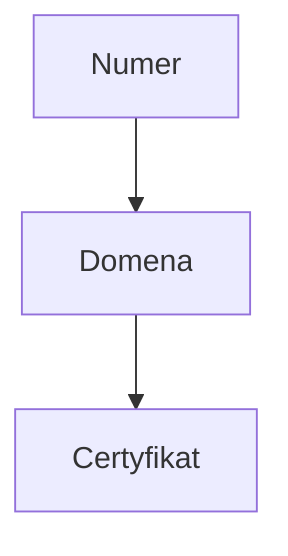

#### Infrastruktura przyszłości:

    Numer -> domena prywatna providera 5G/6G -> Certyfikat -> domena publiczna -> Certyfikat
    
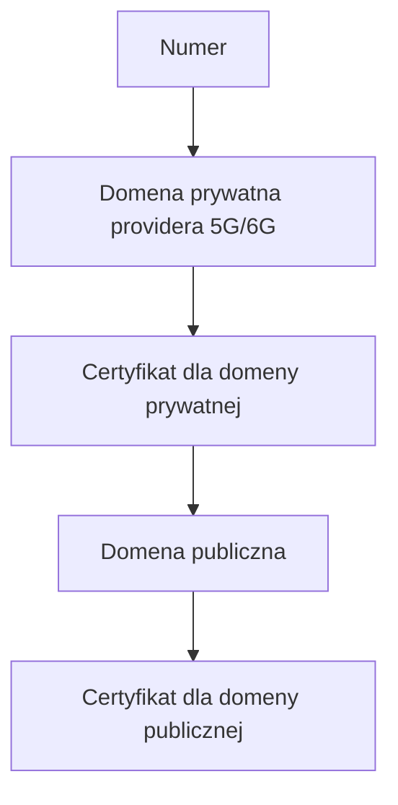

#### Wyjaśnienie:

- W obecnej infrastrukturze, pojęcie "Numer" oznacza punkt startowy, który może być dowolnym identyfikatorem użytkownika lub urządzenia. Ten numer jest następnie przyporządkowany do konkretnej domeny, dla której wydawany jest certyfikat potwierdzający jej tożsamość.

- W przyszłości, z użyciem technologii 5G/6G, możliwe staje się dodanie warstwy "Domena prywatna providera", co wprowadza dodatkowy poziom zarządzania i bezpieczeństwa przed uzyskaniem dostępu do publicznej domeny internetowej. Certyfikaty są wydawane dla obu poziomów domen (prywatnej i publicznej) celem zapewnienia zabezpieczeń na każdym etapie przekierowań.

Ta ewolucja w strukturze infrastruktury odzwierciedla rosnącą złożoność i zapotrzebowanie na dodatkowe warstwy bezpieczeństwa w komunikacji internetowej, szczególnie w kontekście rosnącej integracji technologii mobilnych 5G/6G oraz IoT (Internet of Things).

W kontekście standardów ip6, 5G i 6G jest szansą na użycie domen lokalnie, ale pozostające w gesti providera
Wzrost zainteresowania domenami internetowymi i zwiększone zapotrzebowanie na nie mogą być napędzane przez rozwój i implementację standardów takich jak IPv6, 5G oraz przyszłych technologii 6G, z kilku kluczowych powodów:

**IPv6** oferuje znacznie większą przestrzeń adresową niż IPv4, co rozwiązuje problem wyczerpywania się adresów IP i umożliwia bezpośrednie połączenia do znacznie większej liczby urządzeń.
Zwiększenie liczby urządzeń zdolnych do bezpośredniego połączenia z internetem (wśród nich IoT - Internet rzeczy) podnosi potencjalne zapotrzebowanie na nazwy domen, gdyż każde urządzenie, zwłaszcza te przeznaczone do interakcji z użytkownikiem, może wymagać łatwej do zapamiętania identyfikacji w świecie cyfrowym.

***5G** i przyszłe sieci **6G** mają potencjalnie wnieść rewolucję w szybkości i możliwościach połączeń internetowych, umożliwiając szeroko dostępne, ultrawysokie prędkości przesyłu danych oraz niskie opóźnienia. Dla rozwoju domen internetowych oznacza to kilka rzeczy:

#### Większe możliwości IoT

Zwiększona przepustowość i niższe opóźnienia ułatwią rozwój zaawansowanego IoT, co może przełożyć się na potrzebę posiadania unikalnych domen dla niezliczonych nowych urządzeń i serwisów internetowych.

  
#### Nowe usługi internetowe

Większe prędkości i zasięg mogą stworzyć popyt na nowe rodzaje serwisów online, które będą wymagały rejestracji nowych domen, zarówno dla usług konsumenckich, jak i biznesowych. 

#### Wirtualna i rozszerzona rzeczywistość

Zwiększone prędkości i mniejsze opóźnienia sieciowe są kluczowe dla rozwoju technologii VR (Virtual Reality) i AR (Augmented Reality), co może prowadzić do wzrostu popytu na domeny związane z tymi technologiami.
  

### Wzrost znaczenia i wartości wysokiej jakości domen

Domeny o łatwych do zapamiętania, krótkich i atrakcyjnych nazwach będą nadal cieszyć się dużą wartością ze względu na swój potencjał marketingowy i brandingowy. W miarę jak coraz więcej przedsiębiorstw przenosi się do przestrzeni cyfrowej, konkurencja o atrakcyjne nazwy domen może się zintensyfikować.

### Rozszerzenie i dywersyfikacja TLDs

Top-Level Domains (TLDs) są często uzupełniane o nowe rozszerzenia, co pozwala na większą kreatywność i specjalizację w nazewnictwie domen. 
Możemy spodziewać się wprowadzenia jeszcze więcej niestandardowych TLDs, które odpowiadają na specyficzne potrzeby branż lub społeczności.

### Wzrost znaczenia domen w zdecentralizowanym internecie

Technologie blockchain i zdecentralizowane systemy identyfikacji mogą zmienić sposób, w jaki domeny są zarządzane i przypisane, zapewniając większą kontrolę użytkownikom i zabezpieczenia przed cenzurą. Domeny oparte na blockchainie już istnieją (np. .crypto, .eth), a ich popularność może wzrastać.

#### Rozwój i dywersyfikacja domen TLD

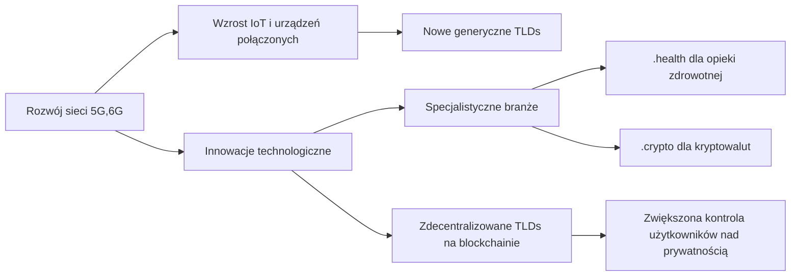

### Domeny jako kluczowy element strategii SEO
Optymalizacja pod kątem wyszukiwarek (SEO) będzie nadal kluczowym elementem strategii online, a posiadanie odpowiedniej domeny – ważnym czynnikiem wpływającym na widoczność w wyszukiwarkach. Domeny zawierające kluczowe słowa lub będące dokładnym dopasowaniem zapytań (Exact Match Domains, EMD) mogą utrzymać swoją wartość dla SEO, choć algorytmy wyszukiwarek ewoluują.
Sztuczna inteligencja korzysta z metadanych przechowywanych przez wyszukiwarki internetowe, dostęp do rzetelnych metadanych jest kluczowe w dalszym prztwarzaniu przez AI.

#### Zmiany w SEO i wartości domen

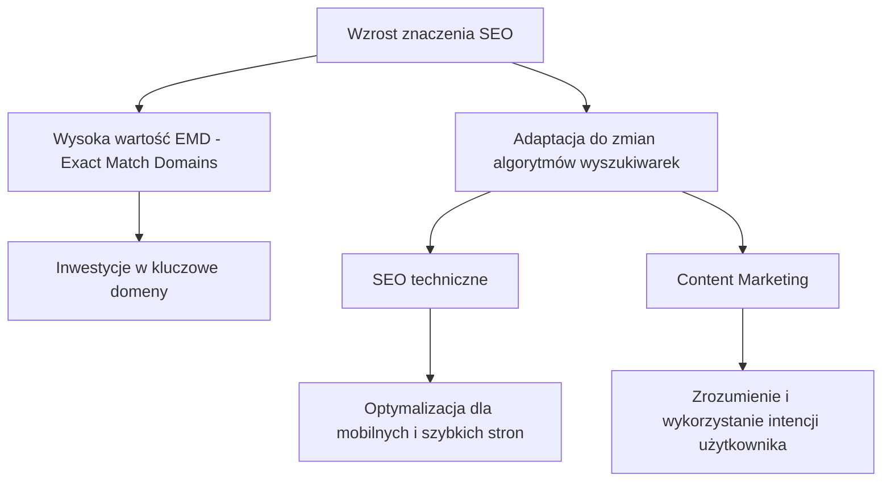

### Zwiększone zapotrzebowanie na zabezpieczenia domen

Wzrost cyberzagrożeń wpłynie na popyt usług związanych z bezpieczeństwem domen, takie jak zabezpieczenia przed kradzieżami domen, zaawansowane zarządzanie certyfikatami SSL/TLS, czy ochrona prywatności danych właściciela domeny.

### Regulacje prawne i ich wpływ na rynek
Wzrost regulacji dotyczących zarządzania domenami, prywatności użytkowników i bezpieczeństwa danych. 
Skomplikowanie prawne może wpłynąć na rynek domen, wymuszając na biznesach i indywidualnych użytkownikach dostosowanie się do nowych przepisów.

#### Bezpieczeństwo i regulacje domen

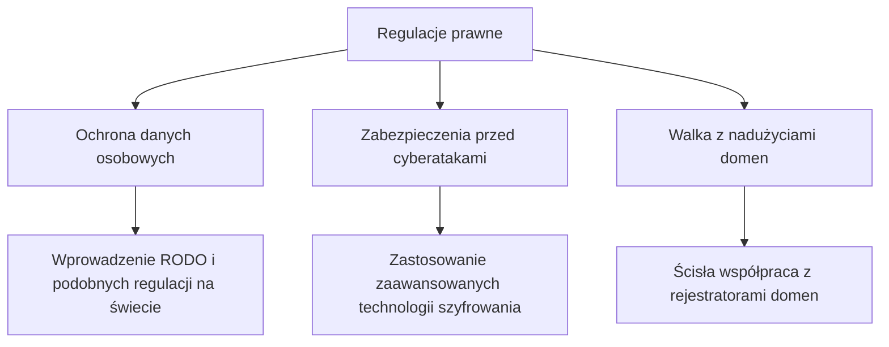

### Podsumowanie

Do roku 2030 rynek domen może stać się bardziej zróżnicowany, z większym naciskiem na bezpieczeństwo, regulacje oraz innowacje technologiczne takie jak blockchain. Chociaż specyficzne trendy mogą się zmieniać, jasne jest, że domeny internetowe pozostaną kluczowym zasobem w cyfrowym ekosystemie. Adaptacja do zmieniającego się środowiska technologicznego i regulacyjnego będzie niezbędna dla podmiotów działających na tym rynku.

## Wywiad z inżynierem IoT

Na koniec raportu chciałbym tylko uzupełnić mój punkt widzenia z osobą, która działa na co dzień z infrastrukturą IoT/edge computing.
Poniższa rozmowa została przeprowadzona za pomocą komunikatora i ze względu na prywatność, nazwisko Inżyniera Embedded zostało ukryte.
Wniosek z rozmowy jest taki, że środowisko IoT naprawdę zmienia nasze podejście do komunikacji w internecie.

**AskDomainer:** 
Jak w praktyce wygląda komunikacja między tymi urządzeniami?

**Maciej:**
Wiele urządzeń IoT, w rzeczywistości, nie wykorzystuje tradycyjnych domen internetowych do komunikacji. 
Zamiast tego, stosują specjalne protokoły komunikacyjne opracowane z myślą o IoT, które są bardziej efektywne i dostosowane do ich potrzeb.

**AskDomainer:** 
Ciekawe, czy mógłbyś podać przykład takiej komunikacji?

**Maciej:**
Wyobraź sobie, że mamy serwer oraz urządzenia IoT. 
Urządzenia te, zamiast komunikować się bezpośrednio między sobą, zazwyczaj odzywają się do serwera po nazwie domenowej. 
Bezpośrednia komunikacja między urządzeniami jest rzadkością i jeśli już, to wykorzystują do tego celu protokoły takie jak mDNS czy Bonjour, głównie w sieci lokalnej.
Urządzenia bateryjne, służą często jako punkt, który zbiera dane telemetryczne pakowanie, implementacja interfejsów, protokołów na poziomie urządzeń embedded jest "overkillem" i dlatego stosuje się alternatywne protokoły,
np:. w standardzie zigbee urządzenia wykorzystują mechanizm discovery do komunikacji bezpośredniej.

**AskDomainer:** 
A co sądzisz o twierdzeniu, że domeny umierają, zwłaszcza w kontekście IoT?

**Maciej:**
To interesująca kwestia. Nie powiedziałbym, że domeny "umierają", ale zdecydowanie następuje zmiana w sposobie ich wykorzystania. 
Producenci mają własne ekosystemy w modelu SaaS. Poza IoT szybsze, tańsze i prostsze może okazać się publikowanie treści w mediach społecznościowych albo korzystanie z usług SaaS, niż tradycyjne zarządzanie hostingiem.

---

## Tom Sapletta

Na co dzień DevOps i ewangelista hipermodularyzacji.
Łączy doświadczenie w programowaniu i research-u poprzez wdrażanie nowatorskich rozwiązań. 
Szerokie spektrum zainteresowań, umiejętności analityczne i doświadczenie w branży owocują pozatechnicznymi treściami jak powyższy raport.

+ [Tom Sapletta, Linkedin](https://www.linkedin.com/in/tom-sapletta-com)
+ [Tom Sapletta, Github](https://github.com/tom-sapletta-com)

---

