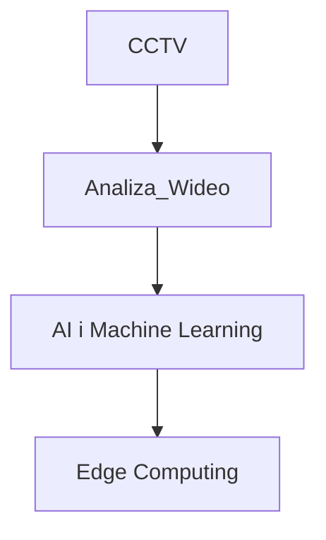
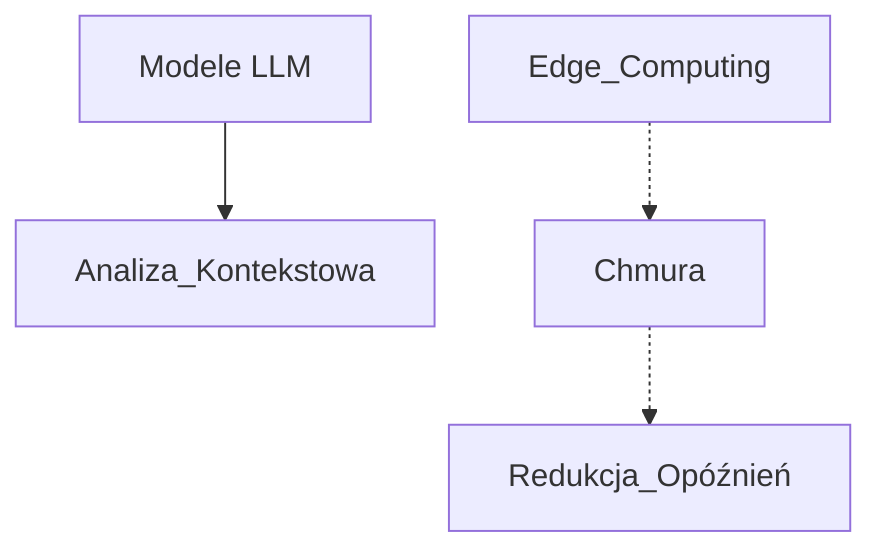
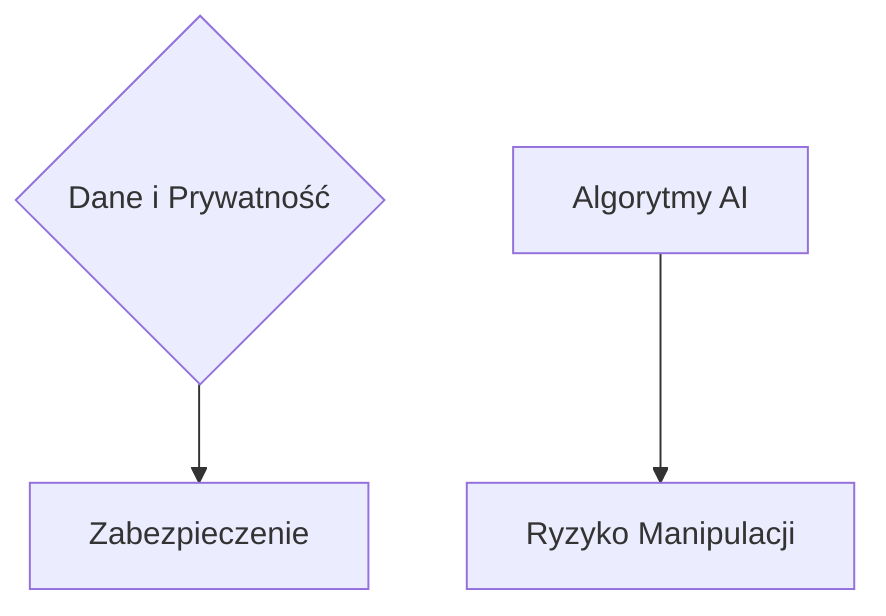
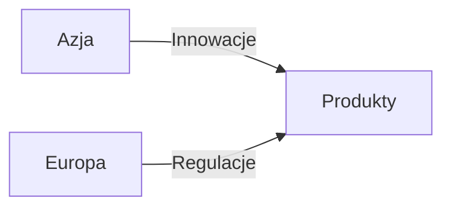
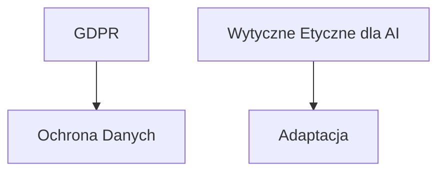
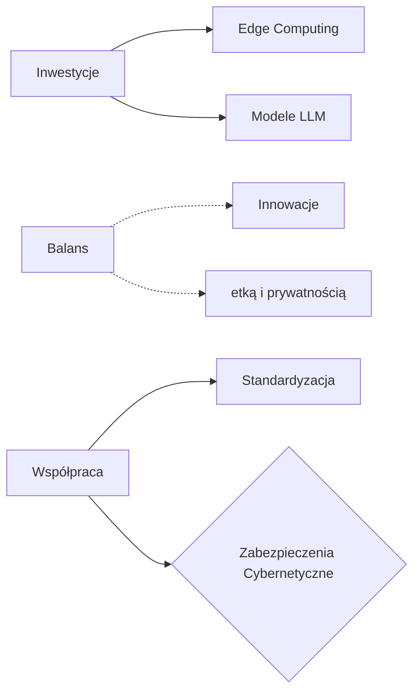

# [www.teleoperator.info](https://www.teleoperator.info/)

Zrozumienie rynku systemów wizyjnych i rozpoznawania obiektów nabiera jeszcze szybszego tempa z racji rozwoju nowych modeli LLM.
w roku 2024 nie jest łatwe, [teleoperator](https://www.teleoperator.info/) służy analizie jakościowej aktualnych trendów, by odpowiedzieć sobie na pytania:
- Jak zmieniał się rynek systemów wizyjnych w zastosowaniach przemysłowych w ostatniej dekadzie?
- Jak zmieni się rynek do roku 2030?

W obliczu dynamicznie zmieniającego się krajobrazu technologicznego, ten raport rzuca światło na postępującą ewolucję infrastruktury monitoringu, wyznaczaną przez rozwój sieci 5G i perspektywy wdrożenia 6G. 
Dokument skupia się na fundamentach i konsekwencjach, w której prywatna infratsruktura 5G/6G odgrywa kluczową rolę.
Raport systemów rozpoznawnaia obiektów dla systów monitorowania CCTV z wykorzystaniem edge computing z przeetwarzaniem LLM obiektów.
Zrozumienie rynku systemów wizyjnych i rozpoznawania obiektów nabiera jeszcze szybszego tempa z racji rozwoju nowych modeli LLM.

### Udostępnij w Social Mediach:

Myślisz o przyszłości internetu i jak technologie 5G/6G odmienią świat domen internetowych? 🌐💡
Sprawdź nasz najnowszy raport ➡️ [Raport Teleoperator.info](https://www.teleoperator.info/)
**📢 Zapraszam wszystkich zainteresowanych branżą monitoringu i technologii bezpieczeństwa! 📷🔒**
#monitorowanie #Innowacje #WizjaKomputerowa #5G #6G #CCTV #AI #Bezpieczeństwo #Cyberbezpieczeństwo 

 
#### Jeśli jesteś:

- **Specjalistą ds. bezpieczeństwa**: Dowiedz się, jak najnowsze trendy i innowacje mogą zwiększyć skuteczność systemów monitoringu w Twojej organizacji. #Bezpieczeństwo #Monitoring
- **Inżynierem wizji komputerowej**: Odkryj, jak AI i rozpoznawanie obiektów zmieniają przemysł. #AI #WizjaKomputerowa
- **Przedsiębiorcą**: Zastanów się, jakie możliwości oferuje rynek kamer i jakie korzyści może przynieść Twojej firmie. #Innowacje #Biznes
- **Pasjonatem technologii**: Śledź rozwój systemów wizyjnych i dowiedz się, jakie projekty opensource warto eksplorować. #Technologia #OpenSource

#### Nie przegap innych raportów! 🌟

1. [MarketsandMarkets - Rynek kamer bezpieczeństwa](https://www.marketsandmarkets.com/Market-Reports/smart-camera-market-195041607.html)
2. [Grand View Research - Rozpoznawanie obiektów wizualnych](https://www.grandviewresearch.com/industry-analysis/image-recognition-market)
3. [Research and Markets - Rynek CCTV](https://www.researchandmarkets.com/report/cctv)
4. [Frost & Sullivan - Analiza rynku technologii nadzoru](https://www.frost.com/news/press-releases/innovation-in-surveillance-technologies-ignites-global-surveillance-solutions-market-growth/)

### Rekomendacje:

Dla **deweloperów**, **managerów**, **inwestorów**, **specjalistów IT**, raport stanowi kluczowe źródło wiedzy o kierunkach rozwoju infrastruktury monitorowania oraz przyszłych wyzwaniach w zakresie bezpieczeństwa cyfrowego. 
**Decydenci biznesowi** znajdą w nim cenne informacje na temat nadchodzących zmian, które mogą wywierać wpływ na strategie cyfrowe ich organizacji. Dla **entuzjastów technologii** i **studentów**, dokument oferuje głęboki wgląd w przyszłość systemów monitoringu.

### Nowa technologia, nowe zagrożenia

Unia Europejska postrzega **cyberbezpieczeństwo** jako jedną z podstaw realizacji swoich celów w zakresie digitalizacji. Jednak czy unijne regulacje nadążają z rozwojem technologicznym i nowymi zagrożeniami dla państw i obywateli? Oto kilka kluczowych obserwacji:

1. **Dynamiczny wzrost i innowacje**:
    - W ciągu ostatniej dekady rynek wizji przeszedł okres niepewności związany z kryzysem finansowym z lat 2007–2008. Jednak z perspektywy czasu ten okres można uznać za preludium do ogromnego wzrostu rynku wizji. W fazie testów znajdują się pojazdy autonomiczne, zaawansowana wirtualna rzeczywistość czy komputery kwantowe.

2. **Wzrost na rynku Azji i Chin**:
    - Większość wzrostu w ostatnich latach miała miejsce w regionie Azji i szczególnie w Chinach. Tam rynek systemów wizyjnych rozwijał się rocznie o około 48%.

3. **Bezpieczeństwo cybernetyczne i elastyczność**:
    - Współczesne systemy wizyjne muszą uwzględniać kwestie bezpieczeństwa cybernetycznego oraz zapewniać elastyczność i łączność.

4. **Młode pokolenie inżynierów i profesjonalistów**:
    - Nowe pokolenie inżynierów wnosi nowe pomysły i oczekiwania dotyczące szybkości rozwoju, prostoty projektowania i interaktywności.

Zapewnienie **cyberbezpieczeństwa** stało się jednym z priorytetów UE. 
Szczegółowe cele w tym obszarze zostały wyznaczone w **Europejskiej Unii Bezpieczeństwa 2020-2025** i opublikowanej w grudniu 2020 unijnej [strategii cyberbezpieczeństwa](https://poland.representation.ec.europa.eu/news/nowa-technologia-nowe-zagrozenia-2021-12-07_pl)

### Źródła:

(1) [Nowa technologia, nowe zagrożenia - Komisja Europejska](https://poland.representation.ec.europa.eu/news/nowa-technologia-nowe-zagrozenia-2021-12-07_pl)
(2) [Europejska unia bezpieczeństwa - Komisja Europejska - European Commission](https://commission.europa.eu/strategy-and-policy/priorities-2019-2024/promoting-our-european-way-life/european-security-union_pl)
(3) [Strategia UE w zakresie unii bezpieczeństwa: wszystkie elementy](https://ec.europa.eu/commission/presscorner/api/files/document/print/pl/ip_20_1379/IP_20_1379_PL.pdf)

### Raport: Systemy Rozpoznawania Obiektów dla Monitoring CCTV z Wykorzystaniem Edge Computing i Przetwarzania LLM

Rynek systemów wizyjnych i technologii rozpoznawania obiektów przeżywa dynamiczny rozwój, napędzany postępem w modelach uczenia głębokiego, zwłaszcza w przetwarzaniu języka naturalnego (LLM - Large Language Models). Dzięki tym innowacjom, możliwe staje się implementowanie zaawansowanych systemów monitoringu wideo, które nie tylko efektywniej rozpoznają i śledzą obiekty, ale również interpretują kontekst sytuacyjny, oferując bezprecedensową precyzję i inteligencję systemów CCTV.

### Główne Punkty Prezentacji Raportu:

#### 1. **Rynek Ostatniej Dekady:**
- Ewolucja z klasycznych systemów CCTV do inteligentnych rozwiązań z wykorzystaniem AI i machine learning.
- Wzrost znaczenia analizy wideo w czasie rzeczywistym dzięki edge computing.

#### 2. **Obecna Sytuacja:**
- Dominacja modeli LLM w analizie kontekstowej obrazów i wideo.
- Integracja z chmurą i urządzeniami edge computing zapewniająca redukcję opóźnień i usprawnienie reakcji systemów.

#### 3. **Wyzwania Cyberbezpieczeństwa:**
- Zabezpieczenie danych i prywatności w systemach rozpoznających obiekty.
- Ryzyko manipulacji obrazem i ataków na algorytmy AI.

#### 4. **Produkty i usługi z Azji vs z Europy:**
- Porównanie podejść regulacyjnych i innowacyjnych między Azją a Europą.
- Wpływ różnic kulturowych i technologicznych na rozwój systemów CCTV.

#### 5. **Zmiany Prawne i Technologiczne w Europie:**
- Adaptacja do GDPR i innych regulacji dotyczących ochrony danych.
- Wprowadzenie etycznych wytycznych dla AI i systemów monitoringu.

#### 6. **Rekomendacje:**
- Inwestycje w rozwój technologii edge computing i LLM dla optymalizacji systemów monitoringu.
- Podkreślenie konieczności balansu między innowacjami a etyką i prywatnością.
- Współpraca międzynarodowa w standardyzacji i zabezpieczeniach cybernetycznych.

Podsumowując, rynek systemów rozpoznawania obiektów dla monitoringu CCTV ewoluuje w kierunku coraz większej integracji z zaawansowanymi technologiami AI, zwłaszcza z wykorzystaniem przetwarzania LLM oraz edge computing. Mimo wyzwań, takich jak cyberbezpieczeństwo czy regulacje prawne, przyszłość zapowiada się obiecująco pod kątem możliwości jakie niosą te innowacje.

### Dyskusja

+ [askdomainer/2024 · Discussion #1](https://github.com/askdomainer/2024/discussions/1)

## Ostatnia dekada

W ciągu ostatniej dekady rynek systemów wizyjnych w zastosowaniach przemysłowych przeszedł wiele zmian. 
Oto kilka kluczowych obserwacji:

1. **Dynamiczny wzrost i innowacje**:
    - Na początku poprzedniej dekady rynek wizji przeszedł okres niepewności związany z kryzysem finansowym z lat 2007–2008. Jednak z perspektywy czasu ten okres można uznać za preludium do ogromnego wzrostu rynku wizji. W ciągu dekady rynek ten zanotował ogólny wzrost o około 10%, a także obfitość innowacji i konsolidację poprzez fuzje i przejęcia firm działających w tej dziedzinie ¹.

2. **Paradygmat AI (sztucznej inteligencji)**:
    - Sztuczna inteligencja, szczególnie w postaci sieci neuronowych, stała się dominującym paradygmatem w automatyzacji wizyjnej. Wiele firm zajmujących się przetwarzaniem obrazów rozwija swoje kompetencje w dziedzinie AI ¹.

3. **Wzrost na rynku Azji i Chin**:
    - Większość wzrostu w ostatnich latach miała miejsce w regionie Azji i szczególnie w Chinach. Tam rynek systemów wizyjnych rozwijał się rocznie o około 48% ².

4. **Współpraca robotów i systemów wizyjnych**:
    - Wzrost popularności robotów współpracujących i platform mobilnych wymaga nowych systemów wizyjnych, które mogą zapewnić bezpieczeństwo i efektywność w takich środowiskach ¹.

5. **Bezpieczeństwo cybernetyczne i elastyczność**:
    - Współczesne systemy wizyjne muszą uwzględniać kwestie bezpieczeństwa cybernetycznego oraz zapewniać elastyczność i łączność ¹.

6. **Młode pokolenie inżynierów i profesjonalistów**:
    - Nowe pokolenie inżynierów wnosi nowe pomysły i oczekiwania dotyczące szybkości rozwoju, prostoty projektowania i interaktywności, wynikające z ich codziennego doświadczenia w cyfrowym świecie ¹.

Podsumowując, rynek systemów wizyjnych jest dynamiczny i pełen możliwości. Wpływ pandemii Covid-19 na ten rynek jest trudny do przewidzenia, ale pewne trendy, takie jak rozwój AI i elastyczność, będą nadal istotne w nadchodzącej dekadzie ¹.

### Źródła:

(1) [Industry 4.0 and AI to shape vision market](https://www.imveurope.com/analysis-opinion/industry-40-and-ai-shape-vision-market)
(2) [Machine Vision Systems: Industrial Applications Rise, but Trade is Hard](https://www.usitc.gov/publications/332/executive_briefings/machine_vision_systems.pdf)
(3) [Trends and Growth in the Machine Vision Market - Cognex](https://www.cognex.com/blogs/machine-vision/future-of-machine-vision-whitepaper)
(4) [Machine Vision Market - Share, Growth, Industry Size & Trends](https://www.mordorintelligence.com/industry-reports/machine-vision-systems-market)

## Najnowsze Technologie i Bezpieczeństwo 

### Branża

Branża monitoringu stale ewoluuje, poniżej lista najnowszych trendów, trendy mogą się zmieniać w zależności od postępu technologicznego i potrzeb rynku.

1. **Inteligentne kamery i analiza w czasie rzeczywistym**:
    - Kamery wyposażone w zaawansowane algorytmy sztucznej inteligencji (AI) mogą wykrywać nieprawidłowości, takie jak nieautoryzowany dostęp lub zachowanie podejrzanej osoby. Analiza w czasie rzeczywistym pozwala na szybką reakcję na potencjalne zagrożenia.

2. **Rozpoznawanie obiektów i twarzy**:
    - Systemy rozpoznawania obiektów wizualnych stają się coraz bardziej precyzyjne. Mogą identyfikować konkretne obiekty, pojazdy, a nawet osoby na podstawie cech twarzy.

3. **Rozwój technologii 5G**:
    - Szybkie połączenia 5G umożliwiają przesyłanie dużej ilości danych z kamer do centrów monitoringu. To przyspiesza reakcję na incydenty.

4. **Kamery termowizyjne i widzenie nocne**:
    - Kamery termowizyjne pozwalają na wykrywanie ciepła emitowanego przez obiekty, co jest przydatne w nocy lub w trudnych warunkach oświetleniowych.

5. **Cyberbezpieczeństwo**:
    - W miarę jak systemy monitoringu stają się bardziej zintegrowane z sieciami komputerowymi, ważne jest zabezpieczenie ich przed atakami hakerów i naruszeniami prywatności.

6. **Integracja z innymi systemami**:
    - Monitorowanie może być bardziej efektywne, gdy jest zintegrowane z systemami kontroli dostępu, alarmowymi i zarządzania budynkiem.

## Monitoring przemysłowy

W branży monitoringu przemysłowego obserwujemy wiele fascynujących trendów.
Oto kilka z nich:

1. **Inteligentne kamery z wykorzystaniem sztucznej inteligencji (AI)**:
    - Kamery "smart" wyposażone w algorytmy AI umożliwiają zaawansowaną analizę, taką jak wykrywanie pojazdów, osób, twarzy, liczenie ruchu i rozpoznawanie tablic rejestracyjnych. Współpraca tych kamer z inteligentnymi analizami pozwala na projektowanie bezpiecznych i efektywnych środowisk monitoringu ¹.

2. **Wzrost popytu na rozwiązania typu "wszystko w jednym"**:
    - Rozwiązania łączące nagrywanie na miejscu z serwerem WAVE są coraz bardziej popularne. Wykorzystanie technologii AI i Deep Learning pozwala na dostarczanie wartościowych informacji biznesowych ¹.

3. **Elastyczne rozwiązania przechowywania w chmurze**:
    - Wymagania projektowe coraz częściej obejmują elastyczne rozwiązania przechowywania w chmurze, które pozwalają na centralizację kamer bez względu na lokalizację. Pomimo pewnych obaw związanych z bezpieczeństwem i dostępem do chmury, coraz więcej użytkowników korzysta z tej technologii ¹.

4. **Przyspieszenie adopcji chmury**:
    - Pandemia przyspieszyła adopcję chmury, a firmy potrzebują szybkich i działających rozwiązań. Chmura pozwala na szybkie wdrożenie systemów wideo. W miarę jak dealerzy i integratorzy stają się bardziej zaznajomieni z platformami wideo w chmurze, coraz więcej klientów korzysta z tej technologii ¹.

Trendy mogą się zmieniać w zależności od postępu technologicznego i potrzeb rynku.

### Źródła:

(1) [Security Trends: Four Surveillance Trends for 2023 and Beyond](https://www.asisonline.org/publications--resources/news/blog/2023/security-trends-four-surveillance-trends)
(2) [Security Megatrends: The 2022 Vision for the Security Industry](https://www.securityindustry.org/report/security-megatrends-the-2022-vision-for-the-security-industry)
(3) [Security Technology Overview & Industry Trends of 2024 + PDF](https://www.avigilon.com/blog/security-technology)
(4) [Security Megatrends: The 2021 Vision for the Security Industry](https://www.securityindustry.org/report/2021-security-megatrends-report)

## Systemy identyfikacji

Wąskim gardłem systemów monitoringu jest człowiek niezbędny do komunikacji z innymi jednostkami organizacji oraz wydająca dezycję o prawach dostępu.
Systemy, które ułatwiają bezpośrednią, łatwą i bezpieczną interakcję typu H2M mogą funkcjonować efektywniej, polegając na innych metodach identyfikacji lub lokalnym dostępie. 

Zgadza się, **bezpośrednia interakcja typu H2M** (czyli interakcja między człowiekiem a maszyną) jest kluczowym aspektem w systemach monitoringu. Oto kilka możliwych kombinacji rozwiązań i systemów, które mogą pomóc w automatyzacji i efektywności:

1. **Rozpoznawanie obiektów i interakcji**:
    - Wykorzystanie zaawansowanych algorytmów rozpoznawania obiektów i ruchu może pomóc w identyfikacji podejrzanych działań. Przykłady projektów opensource:
        - **YOLO (You Only Look Once)**: Szybki i dokładny model do wykrywania obiektów w czasie rzeczywistym ¹.
        - **OpenCV**: Biblioteka do przetwarzania obrazów, która zawiera wiele narzędzi do analizy obrazów i wykrywania obiektów ².

2. **Biometryczne metody identyfikacji**:
    - Wykorzystanie cech biometrycznych, takich jak odciski palców, rozpoznawanie twarzy lub tęczówki oka, może pomóc w bezpiecznym dostępie. Przykłady projektów opensource:
        - **OpenBR**: Platforma do analizy biometrycznej, obejmująca wiele algorytmów rozpoznawania twarzy i innych cech ³.
        - **FingerJetFX**: Narzędzie do przetwarzania odcisków palców ⁴.

3. **Systemy zarządzania dostępem (ACS)**:
    - ACS umożliwiają kontrolę dostępu do pomieszczeń. Przykłady projektów opensource:
        - **AccessControl**: System kontroli dostępu oparty na Raspberry Pi .
        - **Node-RED**: Platforma do tworzenia przepływów automatyzujących różne procesy, w tym zarządzanie dostępem .

4. **Inteligentne kamery i sensory**:
    - Kamery wyposażone w zaawansowane algorytmy AI mogą wykrywać nieprawidłowości. Przykłady projektów opensource:
        - **Motion**: Oprogramowanie do wykrywania ruchu na podstawie obrazów z kamer .
        - **ZoneMinder**: System monitoringu oparty na Linuxie, który obsługuje wiele kamer i funkcji wykrywania ruchu .

Wybór odpowiednich rozwiązań zależy od specyfiki organizacji i jej potrzeb. Warto również uwzględnić aspekty bezpieczeństwa i prywatności przy implementacji tych systemów. 📷🔒

### Źródła:

(1) [Abstract arXiv:2104.11181v2 - 24 Aug 2021](https://arxiv.org/pdf/2104.11181.pdf)
(2) [Two Hands Manipulating Objects for First Person Interaction](https://arxiv.org/abs/2104.11181)
(3) [Two Hands Manipulating Objects for First Person Interaction](https://arxiv.org/pdf/2104.11181v1.pdf)
(4) [taeinkwon](https://www.taeinkwon.com/projects/h2o)

### Projekty opensource

1. **YOLO (You Only Look Once)**:
    - YOLO to podejście do wykrywania obiektów w czasie rzeczywistym. Możesz znaleźć implementację w języku **Python** w repozytorium na GitHubie:
        - [YOLOv1 w PyTorch](https://github.com/tanjeffreyz/yolo-v1)
        - [YOLOv3](https://github.com/zawster/YOLOv3)
        - [YOLOv8](https://docs.ultralytics.com/)

2. **OpenCV (Open Source Computer Vision Library)**:
    - OpenCV to ogromna biblioteka do przetwarzania obrazów i widzenia komputerowego. Jest dostępna w wielu językach programowania. Oto link do repozytorium na GitHubie:
        - [OpenCV](https://github.com/opencv/opencv)

3. **OpenBR (Open Source Biometric Recognition)**:
    - OpenBR to framework do rozpoznawania biometrycznego, wspierający rozwój otwartych algorytmów i powtarzalne oceny. Możesz znaleźć go tutaj:
        - [OpenBR](http://openbiometrics.org/)

4. **FingerJetFX OSE (Fingerprint Feature Extractor)**:
    - FingerJetFX OSE to oprogramowanie do ekstrakcji cech z odcisków palców. Jest dostępne jako open source i może być używane w aplikacjach biometrycznych. Oto link do repozytorium na GitHubie:
        - [FingerJetFX OSE](https://github.com/FingerJetFXOSE/FingerJetFXOSE)

### Projekty

(1) [You Only Look Once: Unified, Real-Time Object Detection](https://arxiv.org/abs/1506.02640)
(2) [GitHub - tanjeffreyz/yolo-v1: PyTorch implementation of the YOLOv1](https://github.com/tanjeffreyz/yolo-v1)
(3) [zawster/YOLOv3: You Only Look Once: Real-Time Object Detection - GitHub](https://github.com/zawster/YOLOv3)
(4) [Home - Ultralytics YOLOv8 Docs](https://docs.ultralytics.com/)
(5) [GitHub - opencv/opencv: Open Source Computer Vision Library](https://github.com/opencv/opencv)
(6) [OpenCV - Open Computer Vision Library](https://opencv.org/)
(7) [OpenCV download | SourceForge.net](https://sourceforge.net/projects/opencvlibrary)
(8) [About - OpenCV](https://opencv.org/about)
(9) [OpenBR | Home](http://openbiometrics.org)
(10) [OpenBR](http://openbiometrics.org/docs)
(11) [biometrics/openbr: Open Source Biometrics, Face Recognition - GitHub](https://github.com/biometrics/openbr)
(12) [GitHub - FingerJetFXOSE/FingerJetFXOSE: Fingerprint Feature Extractor](https://github.com/FingerJetFXOSE/FingerJetFXOSE)
(13) [Name already in use - GitHub](https://github.com/FingerJetFXOSE/FingerJetFXOSE/blob/master/FingerJetFXOSE/libFJFX/include/FJFX.h)
(14) [DigitalPersona Open Sources New FingerJetFX Biometrics Technology - EDN](https://www.edn.com/digitalpersona-open-sources-new-fingerjetfx-biometrics-technology-for-mobile-devices-pcs-and-servers)
(15) [Top 23 access-control Open-Source Projects (Feb 2024) - LibHunt](https://www.libhunt.com/topic/access-control)
(16) [GitHub - onury/accesscontrol: Role and Attribute based Access Control ](https://github.com/onury/accesscontrol)
(17) [GitHub - leosac/access-control: Leosac Access Control - Open Source](https://github.com/leosac/access-control)
(18) [Keycloak](https://www.keycloak.org)
(19) [access-control · GitHub Topics · GitHub](https://github.com/topics/access-control)
(20) [doi](https://doi.org/10.48550/arXiv.1506.02640)
(21) [opencv](https://opencv.org)
(22) [opencv courses](https://opencv.org/courses)
(23) [opencv docs](https://docs.opencv.org/4.x)
(24) [opencv forum](https://forum.opencv.org)
(25) [opencv answers](http://answers.opencv.org)
(26) [opencv github](https://github.com/opencv/opencv/issues)
(27) [github opencv_contrib](https://github.com/opencv/opencv_contrib)
(28) [github support](https://opencv.org/support)
(29) [biometrics](https://github.com/biometrics/openbr.git)
(30) [ominex_test](http://www.nist.gov/itl/iad/ig/ominex_test-results.cfm)
(31) [discord](https://discord.gg/S5UjpzGZjN)
(32) [Getty](https://media.gettyimages.com/photos/summer-memories-sunflowers-picture-id1056933530?b=1&k=20&m=1056933530&s=612x612&w=0&h=tiwrzA7IwPz0jg8w8AGiZgf_p31zq3-3iFWFIaVCIlc=)

## Raporty

Poniżej znajdują się adresy url do raportów pomocne w zrozumieniu i analizie rynku technologii nadzoru
#6G #Architektura #Trendy #Technologia

### [Raport o rynku kamer bezpieczeństwa według MarketsandMarkets](https://www.marketsandmarkets.com/Market-Reports/smart-camera-market-195041607.html)
Ten raport analizuje rynek inteligentnych kamer do celów bezpieczeństwa i monitoringu. Szacuje się, że rynek ten wzrośnie z 1,93 miliarda dolarów w 2015 roku do 3,06 miliarda dolarów w 2020 roku, z rocznym średnim tempem wzrostu wynoszącym 9,7% ¹.

### [Raport Grand View Research na temat rynku rozpoznawania obiektów wizualnych](https://www.grandviewresearch.com/industry-analysis/image-recognition-market)
Ten raport analizuje globalny rynek rozpoznawania obiektów wizualnych. W 2022 roku rynek ten osiągnął wartość 45,02 miliarda dolarów i przewiduje się, że będzie rósł z rocznym średnim tempem wzrostu wynoszącym 13,4% w latach 2023–2030 ¹⁷.

### [Raport o rynku CCTV według Research and Markets](https://www.researchandmarkets.com/report/cctv)
Ten raport analizuje rynek systemów monitoringu CCTV. Przewiduje się, że rynek ten osiągnie wartość 12 643,33 milionów dolarów w okresie 2022–2027, z rocznym średnim tempem wzrostu wynoszącym 11,92% ¹.

### [Analiza rynku technologii nadzoru według Frost & Sullivan](https://www.frost.com/news/press-releases/innovation-in-surveillance-technologies-ignites-global-surveillance-solutions-market-growth/)
Ta analiza obejmuje globalny rynek rozwiązań nadzoru, identyfikując trendy, najlepsze praktyki i czynniki decyzyjne klientów w pięciu pionierskich branżach: organy ścigania, handel detaliczny, przedsiębiorstwa, lotniska oraz bankowość i usługi finansowe ⁵.

### [Raport o architekturze 6G - Perspektywa europejska](https://5g-ppp.eu/wp-content/uploads/2022/12/6G-Arch-Whitepaper_v1.0-final.pdf)

Ten raport to ważne źródło wiedzy dla wszystkich zainteresowanych przyszłością sieci 6G. Obejmuje analizę obecnych trendów społecznych, ekonomicznych, regulacyjnych i technologicznych. 
Kluczowe cechy 6G to inteligentne zarządzanie, programowalność, zintegrowane czujniki i komunikację, redukcja zużycia energii, infrastruktura zaufana, skalowalność i dostępność. 

### Źródła:

### Źródła:

(1) [Global CCTV Market 2023-2027 - Research and Markets](https://www.researchandmarkets.com/report/cctv)
(2) [Image Recognition Market Size, Share & Trends Report 2030](https://www.grandviewresearch.com/industry-analysis/image-recognition-market)
(3) [Global Surveillance Solutions Market - Frost & Sullivan](https://www.frost.com/news/press-releases/innovation-in-surveillance-technologies-ignites-global-surveillance-solutions-market-growth/)
(4) [Video Surveillance Market Research Reports - Research and Markets](https://www.researchandmarkets.com/categories/video-surveillance)
(5) [Global CCTV Cameras Market Size, Market Share- Research and Markets](https://www.researchandmarkets.com/reports/4620314/global-cctv-cameras-market-size-market-share)
(6) [CCTV Global Market Report 2024 - Research and Markets](https://www.researchandmarkets.com/reports/5865918/cctv-global-market-report)
(7) [Global Surveillance Solutions Growth Opportunities - Store.Frost.com](https://store.frost.com/global-surveillance-solutions-growth-opportunities.html)
(8) [Global City Surveillance Market, Forecast to 2022](https://store.frost.com/global-city-surveillance-market-forecast-to-2022.html)
(9) [Competitive Analysis in the Video Surveillance Market - Store.Frost.com](https://store.frost.com/competitive-analysis-in-the-video-surveillance-market.html)
(10) [Frost & Sullivan - Surveillance Market Research Reports & Analysis page](https://www.marketresearch.com/Frost-Sullivan-v383/Surveillance-c1789/1.html)
(11) [Smart Camera Market by Application & Security - MarketsandMarkets](https://www.marketsandmarkets.com/Market-Reports/smart-camera-market-195041607.html)
(12) [Security and Surveillance Market Research Reports - MarketsandMarkets](https://www.marketsandmarkets.com/security-and-surveillance-market-research-260.html)
(13) [Security Cameras Market Analysis | Market Research Future](https://www.marketresearchfuture.com/reports/security-cameras-market/market-analysis)
(14) [Security Cameras Market - MarketsandMarkets](https://www.marketsandmarkets.com/Market-Reports/security-cameras-ir-illuminator-market-55383456.html)
(15) [Video Surveillance Market - MarketsandMarkets](https://www.marketsandmarkets.com/Market-Reports/video-surveillance-market-645.html)
(16) [Grand View Research](https://www.grandviewresearch.com/)
(17) [Image Recognition Market To Reach $128.28Bn By 2030 - Grand View Research](https://www.grandviewresearch.com/press-release/global-image-recognition-market)
(18) [Digital Image Processing Market Trends - Grand View Research](https://www.grandviewresearch.com/industry-analysis/digital-image-processing-market-report)
(19) [Healthcare Automatic Identification And Data Capture Market Size Worth](https://markets.businessinsider.com/news/stocks/healthcare-automatic-identification-and-data-capture-market-size-worth-62-0-billion-by-2028-grand-view-research-inc-1030470104)
(20) [The 6G Architecture Landscape - 5G-PPP](https://5g-ppp.eu/wp-content/uploads/2022/12/6G-Arch-Whitepaper_v1.0-final.pdf)
(21) [European Vision for the 6G Network Ecosystem - 5G-PPP](https://5g-ppp.eu/wp-content/uploads/2021/06/WhitePaper-6G-Europe.pdf)
(22) [6G Fundamentals: Vision and Enabling Technologies: From 5G to 6G](https://jtde.telsoc.org/index.php/jtde/article/view/418)
(23) [doi zenodo](https://doi.org/10.5281/zenodo.7313232)
(24) [How to Use Microsoft Edge to Access Security Cameras - CCTV Camera World](https://www.cctvcameraworld.com/security-cameras/use-microsoft-edge-security-cameras/)
(25) [Edge Computing: Wspieramy Twoją transformację cyfrową - APC](https://www.apc.com/pl/pl/solutions/business-solutions/edge-computing/what-is-edge-computing.jsp)
(26) [Bezpieczne rozwiązania covid-19 z IoT Edge - Azure Architecture Center](https://learn.microsoft.com/pl-pl/azure/architecture/solution-ideas/articles/cctv-iot-edge-for-covid-19-safe-environment-and-mask-detection)

## Przyszłość rynku rozpoznawania obiektów do roku 2030

Przewidywanie przyszłego rozwoju rynku do roku 2030 należy wziąć pod uwagę dynamikę technologii i zmieniające się preferencje użytkowników. 
Opierając się na obecnych trendach i możliwych kierunkach ewolucji technologicznej, można wysnuć pewne przypuszczenia:

1. **MarketsandMarkets** – Jest to firma analityczna oferująca raporty rynkowe w wielu sektorach, w tym w obszarze technologii bezpieczeństwa i monitoringu.

2. **Grand View Research** – Ta firma również specjalizuje się w analizach rynkowych i często publikuje raporty dotyczące rynku kamer bezpieczeństwa, identyfikacji wizualnej i technologii pokrewnych.

3. **Research and Markets** – Na tej platformie można znaleźć szeroki zakres raportów na temat różnych technologii, w tym również systemów bezpieczeństwa i monitoringu wizyjnego.

4. **Statista** – Serwis oferujący dostęp do danych statystycznych i rynkowych z różnych sektorów, w tym z rynku kamer i systemów monitoringu.

5. **TechSci Research** – Koncentruje się na dostarczaniu szczegółowych analiz i prognoz rynkowych z różnych branż technologicznych.

6. **Frost & Sullivan** – Firma doradztwa strategicznego, która publikuje raporty rynkowe, w tym analizy rynku systemów monitoringu i bezpieczeństwa. 

7. **IPVM** – Strona oferuje nie tylko analizy i raporty rynkowe, ale również testy produktów i porównania w dziedzinie monitoringu wideo i bezpieczeństwa.

Aby uzyskać dostęp do najnowszych raportów i analiz, warto odwiedzić strony tych firm i poszukać konkretnych raportów na temat rynku kamer, rejestratorów i technologii identyfikacji wizualnej. Zazwyczaj wymagane jest zakupienie dostępu do pełnych raportów, choć często można znaleźć streszczenia lub ograniczone wersje dostępne za darmo.

### Podsumowanie

Do roku 2030 systemów wizyjnych może stać się bardziej zróżnicowany, z większym naciskiem na bezpieczeństwo, regulacje oraz innowacje technologiczne takie jak blockchain. 
Adaptacja do zmieniającego się środowiska technologicznego i regulacyjnego będzie niezbędna dla podmiotów działających na tym rynku.

---

## Tom Sapletta

Na co dzień DevOps i ewangelista hipermodularyzacji.
Łączy doświadczenie w programowaniu i research-u poprzez wdrażanie nowatorskich rozwiązań. 
Szerokie spektrum zainteresowań, umiejętności analityczne i doświadczenie w branży owocują pozatechnicznymi treściami jak powyższy raport.

+ [Tom Sapletta, Linkedin](https://www.linkedin.com/in/tom-sapletta-com)
+ [Tom Sapletta, Github](https://github.com/tom-sapletta-com)

---

