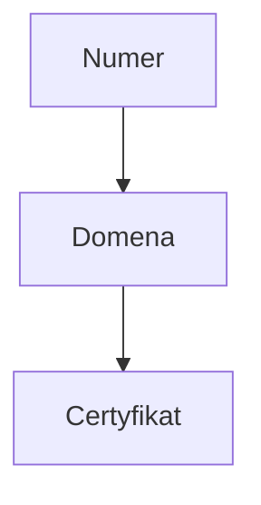
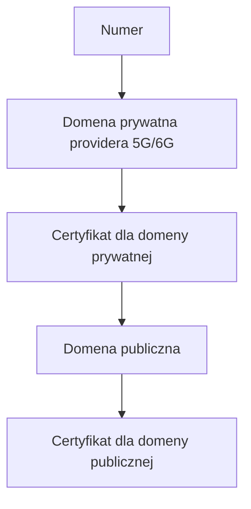
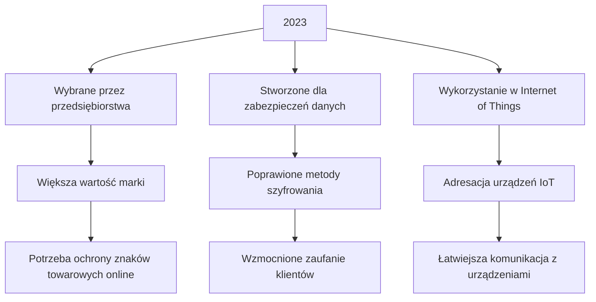
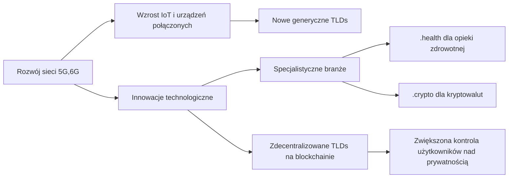
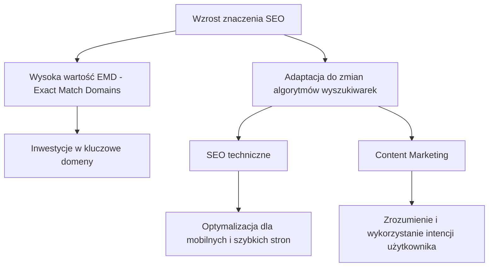
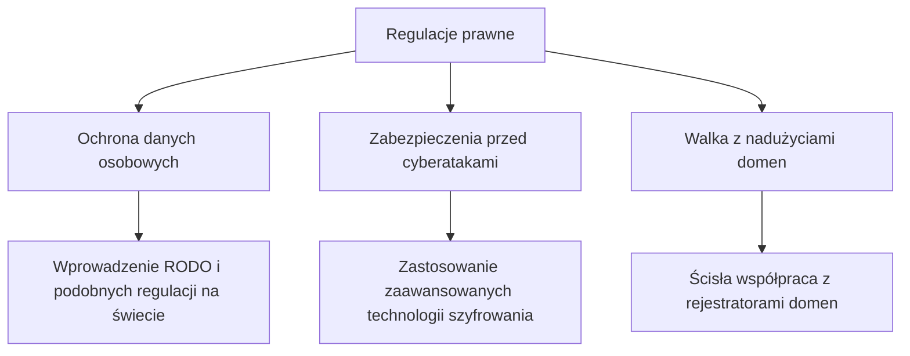

# 2024 - 2024.askdomainer.com

Szukając odpowiedzi na pytania odnośnie stanu rynku domen, zacząłem szukać informacji odnośnie statystyk.
Inetresuje mnie głównie zorzumienie rynku w roku 2024.
Jak zmienia się rynek domen w kontekście zmian kechnologicznych.

w roku 2024 mamy dostęp do wielu usług SaaS, które ułatwiają stworzenie działającej strony internetowej.

System DNS (Domain Name System) odgrywa kluczową rolę w funkcjonowaniu Internetu, tłumacząc łatwe do zapamiętania nazwy domen (np. www.example.com) na skomplikowane adresy IP (np. 192.0.2.1), które są wykorzystywane przez komputery do łączenia się ze sobą. Chociaż system ten jest niezwykle efektywny w mapowaniu nazw stron internetowych, istnieją obszary, w których wykorzystanie DNS mogło być bardziej innowacyjne, ale nie zostało w pełni zrealizowane. Omówmy potencjalnie zaprzepaszczone szanse w kontekście zastępowania numerów telefonów, numerów kont bankowych, czy innych identyfikatorów:

Wykorzystanie domen internetowych w komunikacji między ludźmi (H2H - Human-to-Human) oraz między człowiekiem a maszyną (H2M - Human-to-Machine) mogło otworzyć nowe możliwości dla interakcji w cyfrowym świecie. Proces ten miał potencjał zastąpienia skomplikowanych identyfikatorów numerycznych, adresów IP, identyfikatorów sprzętowych oraz innych trudnych do zapamiętania ciągów cyfr, ułatwiając użytkownikom nawigację i interakcję. Oto kilka przykładów, gdzie wykorzystanie domen mogło mieć większe znaczenie:

### Internet rzeczy (IoT)

Identyfikacja urządzeń i zarządzanie nimi

Domeny internetowe mogłyby zastąpić skomplikowane adresowanie w systemach IoT, ułatwiając użytkownikom identyfikację i komunikację z urządzeniami. Na przykład, zamiast korzystać z długiego i skomplikowanego adresu IP do połączenia się z inteligentną lodówką, użytkownik mógłby po prostu wpisać prostą i intuicyjną nazwę domeny. W kontekście zarządzania flotą urządzeń, takich jak serwery, routery czy też drukarki w dużych organizacjach, ułatwiając zarządzanie i konserwację.

### Usługi bankowe i płatności

Zastąpienie numerów kont bankowych i systemów płatności

Podobnie jak w przypadku numerów kont bankowych i systemów płatności, nazwy domen mogłyby ułatwić przeprowadzanie transakcji finansowych online. Zamiast wprowadzać skomplikowane numery kont, użytkownicy mogliby korzystać z łatwych do zapamiętania nazw, które bezpośrednio wskazują na ich konta.
Jednak bezpieczeństwo i regulacje bankowe wymagają dokładności i bezbłędności, które to są trudne do osiągnięcia w otwartym, rozproszonym systemie jak DNS. Wymóg zachowania bezpieczeństwa transakcji finansowych prawdopodobnie ograniczyłby możliwości takiego zastosowania DNS, chociaż idee takie jak blockchain oferują alternatywne podejścia do rozwiązania tych problemów.

### Telekomunikacja

Zastąpienie numerów telefonów

W telekomunikacji, zamiast stosowania tradycyjnych numerów telefonów, kontakty mogłyby być identyfikowane poprzez nazwy domen. Choć próby takie były podejmowane (np. protokół ENUM), nie osiągnęły one szerszego użycia na skalę masową.
Możliwość użycia nazw domen zamiast numerów telefonów wydaje się kusząca z punktu widzenia łatwości zapamiętywania. Przykładowo, zamiast wymieniania długiego ciągu cyfr, można by było powiedzieć komuś, aby zadzwonił do Ciebie na adres "contact.me@example.com". Technologie takie jak ENUM (Telephone Number Mapping) próbowały połączyć system DNS z tradycyjną telefonią, ale nie osiągnęły szerokiego przyjęcia z powodu skomplikowanego wdrożenia, problemów prywatności, oraz konkurencji ze strony systemów VoIP i komunikatorów internetowych.

### infrastruktura

W kontekście standardów ip6, 5G i 6G jest szansa na użycie domen 

## 

## Uniwersalne identyfikatory
DNS mógłby teoretycznie służyć jako platforma dla uniwersalnych identyfikatorów cyfrowych, umożliwiając łatwiejsze zarządzanie tożsamościami w Internecie. Jednakże wyzwania związane z prywatnością, zarządzaniem i bezpieczeństwem znacząco utrudniają takie zastosowania.

## Przeszkody i wyzwania

Warto zauważyć, że te "zaprzepaszczone szanse" nie są jednoznacznie stratami; są one raczej oznaką ewolucji technologii i preferencji użytkowników, jak również adaptacyjności systemu DNS do rosnących wymagań bezpieczeństwa i funkcjonalności. Ponadto, bardziej zaawansowane technologie, takie jak wspomniane blockchainy, mogą oferować nowe sposoby realizacji tych idei, potencjalnie przezwyciężając ograniczenia, które uniemożliwiły ich pełne wdrożenie w przeszłości.

Mimo potencjalnych zalet, kilka czynników ograniczyło szerokie przyjęcie domen internetowych w tych kontekstach:

### Bezpieczeństwo i prywatność
Na przykład, wrażliwość danych finansowych wymaga dodatkowych warstw zabezpieczeń, których nie zawsze można zapewnić tylko za pomocą nazw domen.

### Techniczne ograniczenia
System DNS, choć niezwykle skalowalny, mógłby napotkać problemy z wydajnością lub celować w zagrożenia, gdyby był nadużywany lub nadmiernie obciążony zapytaniami.

### Opór przed zmianą
Zakorzenione w zwyczajach użycie numerów telefonów i identyfikatorów numerycznych może być trudne do zmienienia, szczególnie w kontekstach, które już dobrze funkcjonują.

W skrócie, choć domeny internetowe oferują atrakcyjną alternatywę dla skomplikowanych ciągów numerycznych, istnieje wiele wyzwań związanych z ich implementacją na szeroką skalę w niektórych obszarach. Moment ten wymaga zarówno innowacji technologicznych, jak i zmian w sposobie myślenia użytkowników oraz regulacjach prawnych.

## Sposób tworzenia stron internetowych
SaaS zamiast PaaS 
Coraz powszechniej są dostępne personalizowane usługi w modelu SaaS ułatwiające tworzenie stron bez udziału Software House-ów

Dekadę temu aby stworzyć stronę www potrzebna była minimalna wiedza do korzystania z PaaS.
Dziś wystarczy tylko dodać nameserver do domeny lub zakupić ją bezpośrednio u usługodawcy.

## Zmiana pokoleniowa

## Zmiana interfejsu komunikacji

głosowy zamiast graficznego

# Przyczyny wpływające na spadek wartości domen internetowych:

## Nadmiar dostępnych nazw domen

Wprowadzenie nowych, generycznych domen najwyższego poziomu (gTLDs) na rynek może spowodować przesycenie i zmniejszenie unikalności posiadania specyficznej nazwy domeny.

## Zmiany w zachowaniach użytkowników

Młodsze pokolenia mogą coraz częściej korzystać z aplikacji społecznościowych, wyszukiwarek wbudowanych w urządzenia czy innych form dostępu do treści online, co sprawia, że tradycyjne domeny internetowe tracą na znaczeniu.

## Innowacje technologiczne

Rozwój alternatywnych technologii, takich jak zdecentralizowany internet (np. technologia blockchain), może zmniejszyć zależność od tradycyjnych struktur nazw domen.

## Zmiany regulacyjne i prawne
Nowe prawa i regulacje dotyczące internetu, prywatności danych oraz cyfrowych aktywów mogą wpłynąć na sposób, w jaki domeny są wyceniane i handlowane.

Wzrost zainteresowania domenami internetowymi i zwiększone zapotrzebowanie na nie mogą być napędzane przez rozwój i implementację standardów takich jak IPv6, 5G oraz przyszłych technologii 6G, z kilku kluczowych powodów:

### Wdrożenie IPv6

**IPv6** oferuje znacznie większą przestrzeń adresową niż IPv4, co rozwiązuje problem wyczerpywania się adresów IP i umożliwia bezpośrednie połączenia do znacznie większej liczby urządzeń.
Zwiększenie liczby urządzeń zdolnych do bezpośredniego połączenia z internetem (wśród nich IoT - Internet rzeczy) podnosi potencjalne zapotrzebowanie na nazwy domen, gdyż każde urządzenie, zwłaszcza te przeznaczone do interakcji z użytkownikiem, może wymagać łatwej do zapamiętania identyfikacji w świecie cyfrowym.

### Rozwój 5G i perspektywy 6G

#### 5G,6G 

***5G** i przyszłe sieci **6G** mają potencjalnie wnieść rewolucję w szybkości i możliwościach połączeń internetowych, umożliwiając szeroko dostępne, ultrawysokie prędkości przesyłu danych oraz niskie opóźnienia. Dla rozwoju domen internetowych oznacza to kilka rzeczy:

#### Większe możliwości IoT
Zwiększona przepustowość i niższe opóźnienia ułatwią rozwój zaawansowanego IoT, co może przełożyć się na potrzebę posiadania unikalnych domen dla niezliczonych nowych urządzeń i serwisów internetowych.
  
#### Nowe usługi internetowe
Większe prędkości i zasięg mogą stworzyć popyt na nowe rodzaje serwisów online, które będą wymagały rejestracji nowych domen, zarówno dla usług konsumenckich, jak i biznesowych.
  

#### Wirtualna i rozszerzona rzeczywistość
Zwiększone prędkości i mniejsze opóźnienia sieciowe są kluczowe dla rozwoju technologii VR (Virtual Reality) i AR (Augmented Reality), co może prowadzić do wzrostu popytu na domeny związane z tymi technologiami.
  

## Najnowsze Technolgie i Bezpieczeństwo 

Zakup własnej domeny internetowej do infrastruktury, zwłaszcza w kontekście rozwiniętych sieci oraz systemów Human-to-Machine (H2M) działających na sieciach 5G i 6G, może przynieść wiele korzyści oraz ułatwień. 

### Korzyści z zakupu własnej domeny internetowej:

#### Profesjonalizm i marka
Własna domena przyczynia się do budowania marki i jest znakiem profesjonalizmu. W kontekście H2M, gdzie aplikacje mogą komunikować się z urządzeniami lub serwerami, łatwa do zapamiętania domena może ułatwić zarządzanie i dostęp.
  
#### Kontrola nad infrastrukturą
Posiadanie własnej domeny daje większą kontrolę nad infrastrukturą i sposobem, w jaki dane są routowane w sieci. Umożliwia to lepsze zarządzanie bezpieczeństwem oraz optymalizację systemów.

#### Łatwość dostępu i nawigacji
W systemach H2M, użytkownicy (ludzie) czasem muszą mieć możliwość łatwego dostępu do interfejsów użytkownika lub paneli zarządzania urządzeniami, co jest ułatwione przez intuicyjne nazwy domen.

### Domena internetowa a systemy H2M:

Domena internetowa nie jest technicznie konieczna do działania systemów H2M opartych na sieciach 5G i 6G. Urządzenia i serwisy mogą komunikować się bezpośrednio przez adresy IP lub lokalne identyfikatory. Jednakże w przypadkach, gdy system zakłada interakcję z użytkownikiem (np. przez przeglądarkę lub aplikację mobilną), własna domena może znacząco ułatwić dostęp i zarządzanie.
  
### Domena internetowa a warstwa szyfrowania:

- Warstwa szyfrowania komunikacji, takiej jak SSL/TLS (Secure Sockets Layer/Transport Layer Security), nie wymaga technicznie posiadania domeny internetowej. Szyfrowanie można zastosować do komunikacji opartej na adresach IP lub w sieciach zamkniętych. Jednakże, w praktyce, certyfikaty SSL/TLS, które zapewniają szyfrowanie i autentykację, są często wydawane dla konkretnych nazw domen. Posiadanie domeny ułatwia zatem wdrażanie szyfrowania "end-to-end" w dostępnych publicznie aplikacjach i usługach internetowych, zapewniając bezpieczeństwo danych użytkowników i systemu.

### Podsumowanie:

Choć technicznie możliwe jest projektowanie i używanie systemów H2M oraz implementacja warstw szyfrowania bez własnej domeny internetowej, posiadanie takiej domeny może przynieść znaczące korzyści w zakresie łatwości dostępu, zarządzania bezpieczeństwem i profesjonalizmu. W kontekście rozwijających się sieci 5G i 6G, które umożliwiają jeszcze większą integrację i komunikację między urządzeniami, własna domena internetowa może stać się coraz bardziej wartościowym zasobem.

## Interfejs

Zapotrzebowanie na domeny internetowe jest ściśle powiązane z rodzajem interfejsu i sposobem, w jaki użytkownicy lub systemy mają dostęp do zasobów cyfrowych. Interfejsy, które ułatwiają bezpośrednią, łatwą i często publiczną interakcję, zazwyczaj korzystają na posiadaniu własnych, łatwych do zapamiętania domen internetowych. W przeciwieństwie do tego, niektóre interfejsy mogą funkcjonować efektywnie bez domen, polegając na innych metodach identyfikacji lub lokalnym dostępie. Oto analiza obu scenariuszy:

### Interfejsy wymagające domen internetowych:

#### Strony WWW
Tradycyjne strony internetowe, sklepy online, blogi itp., które są dostępne dla szerokiej publiczności, korzystają z domen internetowych, aby ułatwić użytkownikom dostęp poprzez łatwe do zapamiętania adresy URL. Domena stanowi integralną część marki w internecie.

#### Web aplikacje
Aplikacje działające w przeglądarce, oferujące szeroki zakres usług (od narzędzi biurowych po platformy rozrywkowe), wymagają domen internetowych do łatwego dostępu i promocji.

#### API (Application Programming Interface)
oparte na sieci: Publicznie dostępne interfejsy programistyczne, które pozwalają na integrację z różnymi usługami i aplikacjami, często korzystają z domen internetowych, aby zapewnić stabilny i łatwo dostępny punkt dostępu.

### Interfejsy, które nie wymagają domen internetowych:

#### Aplikacje desktopowe
Aplikacje instalowane na komputerze użytkownika często komunikują się z internetem lub serwerami backendowymi bezpośrednio przez adresy IP lub za pomocą wewnętrznych identyfikatorów. Domena internetowa nie jest potrzebna do funkcjonowania aplikacji.

#### Aplikacje mobilne
Podobnie jak aplikacje desktopowe, aplikacje mobilne mogą korzystać z usług internetowych bezpośrednio przez zaprogramowane punkty końcowe, które nie muszą być domenami internetowymi zrozumiałymi dla użytkownika końcowego.

#### Wewnętrzne narzędzia i systemy
Systemy używane wewnętrznie przez przedsiębiorstwa, takie jak narzędzia do zarządzania bazami danych, wewnętrzne portale pracownicze czy systemy zarządzania treścią (CMS), mogą działać w izolowanej sieci korporacyjnej, wykorzystując nazwy hostów lub lokalne adresy IP bez potrzeby posiadania publicznych domen internetowych.

#### Interfejsy dla urządzeń IoT
Chociaż niektóre urządzenia IoT mogą korzystać z domen w celach zarządzania lub monitorowania, sama komunikacja między urządzeniami lub z serwerami backendowymi często odbywa się za pomocą protokołów komunikacyjnych specyficznych dla IoT, które nie wymagają użycia domen internetowych w tradycyjnym sensie.

### Podsumowanie:

Ogólnie rzecz biorąc, zapotrzebowanie na domeny internetowe zależy od natury interfejsu i publicznego dostępu do usługi. Publicznie dostępne serwisy, które wymagają łatwej identyfikacji i dostępu, będą miały większe korzyści z używania domen. W kontrze, aplikacje i systemy działające w zamkniętych lub spe

## Przyszłość rynku domen do roku 2030

Przewidywanie przyszłego rozwoju rynku domen do roku 2030 należy wziąć pod uwagę dynamikę technologii i zmieniające się preferencje użytkowników. 
Opierając się na obecnych trendach i możliwych kierunkach ewolucji technologicznej, można wysnuć pewne przypuszczenia:

### Kolejne warstwy infrastruktury

Poniżej przedstawiam sposób, w jaki można zobrazować opisaną infrastrukturę za pomocą notacji Mermaid. Diagram przedstawia uproszczone podejście do ewolucji infrastruktury od obecnej struktury "Numer -> domena -> Certyfikat" do przyszłej struktury, w której domena prywatna providera 5G/6G odgrywa rolę pośrednika przed dotarciem do domeny publicznej i kolejnych certyfikatów:

### Infrastruktura:

    Numer -> domena -> Certyfikat
    

### Infrastruktura przyszłości:

    Numer -> domena prywatna providera 5G/6G -> Certyfikat -> domena publiczna -> Certyfikat
    

### Wyjaśnienie:

- W obecnej infrastrukturze, pojęcie "Numer" oznacza punkt startowy, który może być dowolnym identyfikatorem użytkownika lub urządzenia. Ten numer jest następnie przyporządkowany do konkretnej domeny, dla której wydawany jest certyfikat potwierdzający jej tożsamość.

- W przyszłości, z użyciem technologii 5G/6G, możliwe staje się dodanie warstwy "Domena prywatna providera", co wprowadza dodatkowy poziom zarządzania i bezpieczeństwa przed uzyskaniem dostępu do publicznej domeny internetowej. Certyfikaty są wydawane dla obu poziomów domen (prywatnej i publicznej) celem zapewnienia zabezpieczeń na każdym etapie przekierowań.

Ta ewolucja w strukturze infrastruktury odzwierciedla rosnącą złożoność i zapotrzebowanie na dodatkowe warstwy bezpieczeństwa w komunikacji internetowej, szczególnie w kontekście rosnącej integracji technologii mobilnych 5G/6G oraz IoT (Internet of Things).

### Wzrost znaczenia i wartości wysokiej jakości domen
Domeny o łatwych do zapamiętania, krótkich i atrakcyjnych nazwach będą nadal cieszyć się dużą wartością ze względu na swój potencjał marketingowy i brandingowy. W miarę jak coraz więcej przedsiębiorstw przenosi się do przestrzeni cyfrowej, konkurencja o atrakcyjne nazwy domen może się zintensyfikować.

### Rozszerzenie i dywersyfikacja TLDs
Top-Level Domains (TLDs) są często uzupełniane o nowe rozszerzenia, co pozwala na większą kreatywność i specjalizację w nazewnictwie domen. 
Możemy spodziewać się wprowadzenia jeszcze więcej niestandardowych TLDs, które odpowiadają na specyficzne potrzeby branż lub społeczności.

### Wzrost znaczenia domen w zdecentralizowanym internecie
Technologie blockchain i zdecentralizowane systemy identyfikacji mogą zmienić sposób, w jaki domeny są zarządzane i przypisane, zapewniając większą kontrolę użytkownikom i zabezpieczenia przed cenzurą. Domeny oparte na blockchainie już istnieją (np. .crypto, .eth), a ich popularność może wzrastać.

### Domeny jako kluczowy element strategii SEO
Optymalizacja pod kątem wyszukiwarek (SEO) będzie nadal kluczowym elementem strategii online, a posiadanie odpowiedniej domeny – ważnym czynnikiem wpływającym na widoczność w wyszukiwarkach. Domeny zawierające kluczowe słowa lub będące dokładnym dopasowaniem zapytań (Exact Match Domains, EMD) mogą utrzymać swoją wartość dla SEO, choć algorytmy wyszukiwarek ewoluują.

### Zwiększone zapotrzebowanie na zabezpieczenia domen
Wzrost cyberzagrożeń wpłynie na popyt usług związanych z bezpieczeństwem domen, takie jak zabezpieczenia przed kradzieżami domen, zaawansowane zarządzanie certyfikatami SSL/TLS, czy ochrona prywatności danych właściciela domeny.

### Regulacje prawne i ich wpływ na rynek
Wzrost regulacji dotyczących zarządzania domenami, prywatności użytkowników i bezpieczeństwa danych. 
Skomplikowanie prawne może wpłynąć na rynek domen, wymuszając na biznesach i indywidualnych użytkownikach dostosowanie się do nowych przepisów.

### Podsumowanie
Do roku 2030 rynek domen może stać się bardziej zróżnicowany, z większym naciskiem na bezpieczeństwo, regulacje oraz innowacje technologiczne takie jak blockchain. Chociaż specyficzne trendy mogą się zmieniać, jasne jest, że domeny internetowe pozostaną kluczowym zasobem w cyfrowym ekosystemie. Adaptacja do zmieniającego się środowiska technologicznego i regulacyjnego będzie niezbędna dla podmiotów działających na tym rynku.

### Wzrost znaczenia domen internetowych

### Rozwój i dywersyfikacja domen TLD

### Zmiany w SEO i wartości domen

### Bezpieczeństwo i regulacje domen

