# [www.teleoperator.info](https://www.teleoperator.info/)

Zrozumienie rynku systemów wizyjnych i rozpoznawania obiektów nabiera jeszcze szybszego tempa z racji rozwoju nowych modeli LLM.
w roku 2024 nie jest łatwe, [teleoperator](https://www.teleoperator.info/) służy analizie jakościowej aktualnych trendów, by odpowiedzieć sobie na pytania:
- Jak zmieniał się rynek domen w ostatniej dekadzie?
- Jak zmieni się rynek do roku 2030?

W obliczu dynamicznie zmieniającego się krajobrazu technologicznego, ten raport rzuca światło na postępującą ewolucję infrastruktury internetowej, wyznaczaną przez rozwój sieci 5G i perspektywy wdrożenia 6G. 
Dokument skupia się na fundamentach i konwekwencjach w której prywatne domeny providerów 5G/6G odgrywają kluczową rolę jako pośrednicy w dostępie do domen publicznych.

Raport systemów rozpoznawnaia obiektów dla systów monitorowania CCTV z wykorzystaniem edge computing z przeetwarzaniem LLM obiektów.
Zrozumienie rynku systemów wizyjnych i rozpoznawania obiektów nabiera jeszcze szybszego tempa z racji rozwoju nowych modeli LLM.

### Główne Punkty

#### Obecna Struktura

#### Nowe Warstwy Bezpieczeństwa

#### Zmiany prawne i technologiczne

### Rekomendacje:

Dla **deweloperów**, **spekulantów**, **inwestorów**, **specjalistów IT**, raport stanowi kluczowe źródło wiedzy o kierunkach rozwoju infrastruktury internetowej oraz przyszłych wyzwaniach w zakresie bezpieczeństwa cyfrowego. 
**Decydenci biznesowi** znajdą w nim cenne informacje na temat nadchodzących zmian, które mogą wywierać wpływ na strategie cyfrowe ich organizacji. Dla **entuzjastów technologii** i **studentów**, dokument oferuje głęboki wgląd w przyszłość komunikacji internetowej.

### Udostępnij w Social Mediach:

Myślisz o przyszłości internetu i jak technologie 5G/6G odmienią świat domen internetowych? 🌐💡 Sprawdź nasz najnowszy raport, który zagłębia się w nadchodzące zmiany infrastruktury internetowej! 
Idealna lektura dla każdego technofila! #5G #6G #InternetPrzyszłości #BezpieczeństwoCyfrowe ➡️ [teleoperator](https://www.teleoperator.info/)

### Raport: Systemy Rozpoznawania Obiektów dla Monitoring CCTV z Wykorzystaniem Edge Computing i Przetwarzania LLM

Rynek systemów wizyjnych i technologii rozpoznawania obiektów przeżywa dynamiczny rozwój, napędzany postępem w modelach uczenia głębokiego, zwłaszcza w przetwarzaniu języka naturalnego (LLM - Large Language Models). Dzięki tym innowacjom, możliwe staje się implementowanie zaawansowanych systemów monitoringu wideo, które nie tylko efektywniej rozpoznają i śledzą obiekty, ale również interpretują kontekst sytuacyjny, oferując bezprecedensową precyzję i inteligencję systemów CCTV.

### Główne Punkty Prezentacji Raportu:

#### 1. **Rynek Ostatniej Dekady:**
- Ewolucja z klasycznych systemów CCTV do inteligentnych rozwiązań z wykorzystaniem AI i machine learning.
- Wzrost znaczenia analizy wideo w czasie rzeczywistym dzięki edge computing.

#### 2. **Obecna Sytuacja:**
- Dominacja modeli LLM w analizie kontekstowej obrazów i wideo.
- Integracja z chmurą i urządzeniami edge computing zapewniająca redukcję opóźnień i usprawnienie reakcji systemów.

```mermaid
graph TD;
    LLM[Modele LLM] --> Analiza_Kontekstowa;
    Edge_Computing -.-> Chmura;
    Chmura -.-> Redukcja_Opóźnień;
```

#### 3. **Wyzwania Cyberbezpieczeństwa:**
- Zabezpieczenie danych i prywatności w systemach rozpoznających obiekty.
- Ryzyko manipulacji obrazem i ataków na algorytmy AI.

```mermaid
graph TD;
    Dane{Dane i Prywatność} --> Zabezpieczenie;
    AI[Algorytmy AI] --> Ryzyko_Manipulacji[Ryzyko Manipulacji];
```

#### 4. **Produkty i usługi z Azji vs z Europy:**
- Porównanie podejść regulacyjnych i innowacyjnych między Azją a Europą.
- Wpływ różnic kulturowych i technologicznych na rozwój systemów CCTV.

#### 5. **Zmiany Prawne i Technologiczne w Europie:**
- Adaptacja do GDPR i innych regulacji dotyczących ochrony danych.
- Wprowadzenie etycznych wytycznych dla AI i systemów monitoringu.

#### 6. **Rekomendacje:**
- Inwestycje w rozwój technologii edge computing i LLM dla optymalizacji systemów monitoringu.
- Podkreślenie konieczności balansu między innowacjami a etyką i prywatnością.
- Współpraca międzynarodowa w standardyzacji i zabezpieczeniach cybernetycznych.

```mermaid
graph LR;
    Inwestycje --> Edge_Computing[Edge Computing] & LLM[Modele LLM];
    Balans -.-> Innowacje & Prywatność[etką i prywatnością];
    Współpraca --> Standardyzacja & Zabezpieczenia{Zabezpieczenia Cybernetyczne};
```

Podsumowując, rynek systemów rozpoznawania obiektów dla monitoringu CCTV ewoluuje w kierunku coraz większej integracji z zaawansowanymi technologiami AI, zwłaszcza z wykorzystaniem przetwarzania LLM oraz edge computing. Mimo wyzwań, takich jak cyberbezpieczeństwo czy regulacje prawne, przyszłość zapowiada się obiecująco pod kątem możliwości jakie niosą te innowacje.

### Dyskusja

+ [askdomainer/2024 · Discussion #1](https://github.com/askdomainer/2024/discussions/1)

## Wstęp

### Domain Name System

System DNS (Domain Name System) odgrywa kluczową rolę w funkcjonowaniu Internetu, tłumacząc łatwe do zapamiętania nazwy domen (np. www.example.com) na skomplikowane adresy IP (np. 192.0.2.1), które są wykorzystywane przez komputery do łączenia się ze sobą. Chociaż system ten jest niezwykle efektywny w mapowaniu nazw stron internetowych, istnieją obszary, w których wykorzystanie DNS mogło być bardziej innowacyjne. O czym napisano w kolejnych punktach.

### Komunikacja

Wykorzystanie domen internetowych w komunikacji między ludźmi (H2H - Human-to-Human) oraz między człowiekiem a maszyną (H2M - Human-to-Machine) mogło otworzyć nowe możliwości dla interakcji w cyfrowym świecie. Proces ten miał potencjał zastąpienia skomplikowanych identyfikatorów numerycznych, adresów IP, identyfikatorów sprzętowych oraz innych trudnych do zapamiętania ciągów cyfr, ułatwiając użytkownikom nawigację i interakcję. 

## Zaprzepaszczone Szanse

## Przyczyny spadku wartości domen internetowych

## Najnowsze Technologie i Bezpieczeństwo 

## Interfejs

Zapotrzebowanie na domeny internetowe jest ściśle powiązane z rodzajem interfejsu i sposobem, w jaki użytkownicy lub systemy mają dostęp do zasobów cyfrowych. Interfejsy, które ułatwiają bezpośrednią, łatwą i często publiczną interakcję, zazwyczaj korzystają na posiadaniu własnych, łatwych do zapamiętania domen internetowych. W przeciwieństwie do tego, niektóre interfejsy mogą funkcjonować efektywnie bez domen, polegając na innych metodach identyfikacji lub lokalnym dostępie. 

## Przyszłość rynku domen do roku 2030

Przewidywanie przyszłego rozwoju rynku domen do roku 2030 należy wziąć pod uwagę dynamikę technologii i zmieniające się preferencje użytkowników. 
Opierając się na obecnych trendach i możliwych kierunkach ewolucji technologicznej, można wysnuć pewne przypuszczenia:

### Podsumowanie

Do roku 2030 rynek domen może stać się bardziej zróżnicowany, z większym naciskiem na bezpieczeństwo, regulacje oraz innowacje technologiczne takie jak blockchain. Chociaż specyficzne trendy mogą się zmieniać, jasne jest, że domeny internetowe pozostaną kluczowym zasobem w cyfrowym ekosystemie. Adaptacja do zmieniającego się środowiska technologicznego i regulacyjnego będzie niezbędna dla podmiotów działających na tym rynku.

## Wywiad z inżynierem IoT

Na koniec raportu chciałbym tylko uzupełnić mój punkt widzenia z osobą, która działa na co dzień z infrastrukturą IoT/edge computing.
Poniższa rozmowa została przeprowadzona za pomocą komunikatora i ze względu na prywatność, nazwisko Inżyniera Embedded zostało ukryte.
Wniosek z rozmowy jest taki, że środowisko IoT naprawdę zmienia nasze podejście do komunikacji w internecie.

**AskDomainer:** 
Jak w praktyce wygląda komunikacja między tymi urządzeniami?

**Maciej:**
Wiele urządzeń IoT, w rzeczywistości, nie wykorzystuje tradycyjnych domen internetowych do komunikacji. 
Zamiast tego, stosują specjalne protokoły komunikacyjne opracowane z myślą o IoT, które są bardziej efektywne i dostosowane do ich potrzeb.

**AskDomainer:** 
Ciekawe, czy mógłbyś podać przykład takiej komunikacji?

**Maciej:**
Wyobraź sobie, że mamy serwer oraz urządzenia IoT. 
Urządzenia te, zamiast komunikować się bezpośrednio między sobą, zazwyczaj odzywają się do serwera po nazwie domenowej. 
Bezpośrednia komunikacja między urządzeniami jest rzadkością i jeśli już, to wykorzystują do tego celu protokoły takie jak mDNS czy Bonjour, głównie w sieci lokalnej.
Urządzenia bateryjne, służą często jako punkt, który zbiera dane telemetryczne pakowanie, implementacja interfejsów, protokołów na poziomie urządzeń embedded jest "overkillem" i dlatego stosuje się alternatywne protokoły,
np:. w standardzie zigbee urządzenia wykorzystują mechanizm discovery do komunikacji bezpośredniej.

**AskDomainer:** 
A co sądzisz o twierdzeniu, że domeny umierają, zwłaszcza w kontekście IoT?

**Maciej:**
To interesująca kwestia. Nie powiedziałbym, że domeny "umierają", ale zdecydowanie następuje zmiana w sposobie ich wykorzystania. 
Producenci mają własne ekosystemy w modelu SaaS. Poza IoT szybsze, tańsze i prostsze może okazać się publikowanie treści w mediach społecznościowych albo korzystanie z usług SaaS, niż tradycyjne zarządzanie hostingiem.

---

## Tom Sapletta

Na co dzień DevOps i ewangelista hipermodularyzacji.
Łączy doświadczenie w programowaniu i research-u poprzez wdrażanie nowatorskich rozwiązań. 
Szerokie spektrum zainteresowań, umiejętności analityczne i doświadczenie w branży owocują pozatechnicznymi treściami jak powyższy raport.

+ [Tom Sapletta, Linkedin](https://www.linkedin.com/in/tom-sapletta-com)
+ [Tom Sapletta, Github](https://github.com/tom-sapletta-com)

---

